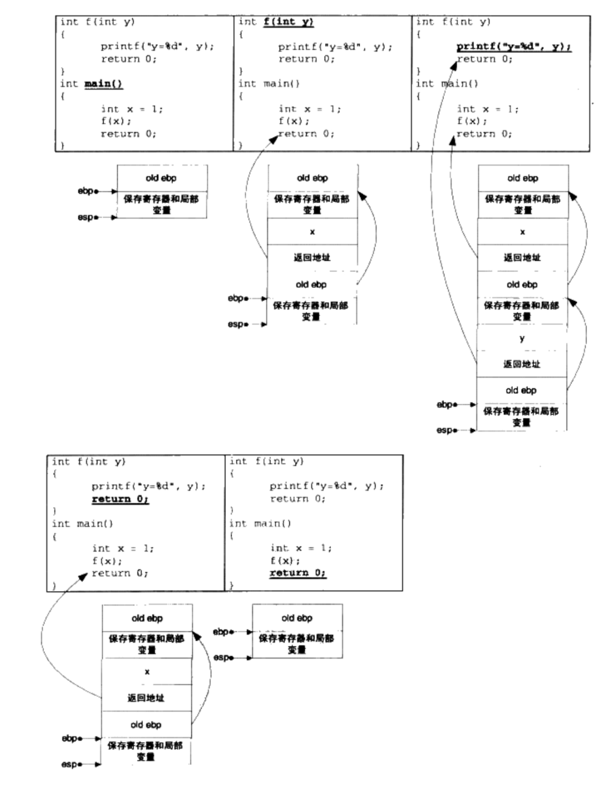

# 10. 内存 

## 10.1  程序的内存布局 

一般来说，32位的系统，大多操作系统会把4GB的一部分挪给内核使用，这一部分内存地址叫做内核空间。默认情况下Windows将高地址2GB空间分配给内核(也可以配置为1GB)。Linux将高地址1GB分配给内核。

用户使用的剩下的2GB或3GB空间称为用户空间。用户空间也可以分为如下“默认”区域

- 栈(Stack): 栈用于维护函数调用的上下文，离开栈，函数调用就无法实现。栈通常在用户空间的最高
- 堆(Heap): 堆时用来容纳应用程序动态分配的内存区域，当程序使用malloc或new分配内存时，得到的内存来自堆。堆通常位于栈的下方（低地址防线），一般堆比栈大很多。
- 可执行文件映像: 这里存储着可执行文件在内存里的映像，由装载器在装载时将可执行文件的内存读取或映射到这里。
- 保留区: 保留区并不是单一的内存区域，而是对内存中受保护而禁止访问的内存区域总称，例如，大多数操作系统里，极小的地址通常时不允许访问的，如NULL。

linux进程地址空间分布如图:


图中有个区域没有介绍，“动态链接库映射区”，这个区用于映射装载动态链接库。linux下，如果可执行文件依赖其他共享内存，那么系统会为他从0x40000000开始的地址分配相应的空间，并将共享库载入该空间。


## 10.2 栈与调用惯例

### 10.2.1 什么是栈

栈的定义。

在经典操作系统中，栈总是向下增长的。在i386下，栈顶由称为esp的寄存器进行定位。压栈的操作使栈顶地址减小，弹出的操作使栈顶地址增大。


栈保存了一个函数调用所需要的维护信息，这常常被称为栈帧(Stack Frame)或活动记录(Activate Record)。栈帧一般包含下面几项内容：

- 函数返回地址和参数
- 临时变量：包括函数的非静态局部变量以及编译器自动生成的其他临时变量。
- 保存的上下文：包括在函数调用前后需要保持不变的寄存器。

在i386中，一个函数的活动记录用ebp和esp两个寄存器划归范围。esp始终指向栈顶，同时也是当前函数的活动记录顶部。ebp寄存器指向了函数活动记录的一个固定位置，ebp又被称为帧指针(Frame Pointer)。

一个常见的活动记录


如图所示，ebp固定在图中所示位置，不随这个函数的执行二变化，相反地，esp始终指向栈顶，因此随着函数执行，esp会不断变化。固定的ebp可以用来定位函数活动记录中的各个数据。ebp之前的是返回地址，ebp-4。再往前是入栈的参数，地址分别为ebp-8，ebp-12等，视参数的数量和大小而定。ebp指向的数据是调用该函数前ebp的值，这样在函数返回时，ebp可以读取这个值恢复到调用前的值。

i386函数调用：

- 把所有或一部分参数压入栈，如果有一些参数没有入栈，那么使用某些特定的寄存器传递。
- 把当前指令的下一条指令的地址压入栈中。
- 跳转到函数体执行。

其中第2步和第3步由指令call一起执行。

i386函数体的“标准”开头就这样（但存在不一样的情况）：

- push ebp: 把ebp压入栈（old ebp）
- move ebp, esp; ebp=esp（这时ebp指向栈顶，二此时，栈顶就是old ebp）
- （可选）sub esp, xxx; （栈上申请xxx字节的空间）
- （可选）push XXX: 如有必要，保存名为xxx的寄存器(可重复多个)

把ebp压入栈中，为了函数返回的时候便于恢复以前的ebp值。而之所以可能要保存一些寄存器，在于编译器可能要求某些寄存器在调用后保持不变，那么函数可以在调用开始时将这些寄存器的值压入栈中，在结束后再取出。

- （可选）pop xxx；如有必要，恢复保存过的寄存器（可重复多个）
- mov esp, ebp; 恢复ESP同时回收局部变量空间
- pop ebp； 从栈中恢复ebp的值
- ret；从栈中获得返回地址，并跳转到该位置。

    gcc编译器有个参数-fomit-frame-pointer 可以取消帧指针，不使用ebp而是使用esp直接计算帧上的变量位置。

```c
int foo()
{
    return 123;
}
```

函数使用VC9，i386 Debug模式得到如下结果:


第5步的时候，函数将0x7B（即123）赋值给eax，作为返回值传出。调用方可以通过读取寄存器来获取返回值。

i386标准函数进入和退出指令序列，基本形式：

    push ebp
    mov ebp, esp
    sub sub, x
    [push reg1]
    ...
    [push regn]

    函数实际内容

    [pop regen]
    ...
    [pop reg1]
    mov esp, ebp
    pop ebp
    ret

其中在栈上开辟x字节的临时空间，reg1...regn分别代表要保存的n个寄存器。不过在有些场合，编译器生成函数的进入和退出指令序列并不按照标准的方式进行。例如一个满足如下要求的c函数

- 函数被申明为static (不可在此编译单元之外访问)
- 函数在本编译单元仅被直接调用，没有显示或隐式取地址（即没有任务函数指针指向过这个函数）


### 10.2.2 调用惯例 

**调用惯例**(Calling Convention)

假设一个函数
```C
int foo(int n, int m)
{
    int a = 0;
    int b = 0;
    ...
}

```


- 函数参数的传递顺序和方式

    函数参数的传递方式有很多种，最常见的就是通过栈传递。函数的调用方将参数压入栈中，函数自己再从栈中将参数取出。对于有多个参数的函数，调用惯例要规定函数调用方将参数压栈的顺序：是从左到右，还是从右到左。有些惯例还允许使用寄存器传递参数，以提高性能。

- 栈的维护方式

    在函数将参数压栈之后，函数体会被调用，此后需要将压入栈中的参数全部弹出，以使得栈在函数调用前后保持一致。这个弹出的工作可以由函数的调用方来完成，也可以由函数本身来完成。

- 名字修饰（name-mangling）策略

    为了链接的时候对调用惯例进行区分，调用惯例要对函数本身的名字进行修饰。不同的调用惯例有不同的名字修饰策略。


C语言有多个调用惯例，默认的是cdecl，内容如下

|  参数传递              |  出栈方      |  名字修饰              |
| :-------------------- | :---------- | :-------------------- |
| 从右至左的顺序压参数入栈  |  函数调用方  | 直接在函数名前加一个下划线 |


因此，按照cdecl的调用惯例，foo函数的修饰之后变为_foo，具体栈操作如下：

- 将m压入栈
- 将n压入栈
- 调用_foo，这里又分为两个步骤

    - a) 将返回地址(即调用_foo之后的下一条指令地址)压入栈
    - b) 跳转_foo执行

如图: 


foo函数里需要保存一系列寄存器，包括调用方的ebp寄存器，以及要为a和b两个局部变量分配空间。最终栈布局如下：


调用及恢复的过程，代码如下:

```C
void f(int x, int y)
{
    ...
    return;
}

int main()
{
    f(1, 3);
    return 0;
}

```


虚线指向该指令执行后的栈状态，实线表示程序的跳转状况。

```C
void f(int y)
{
    printf("y=%d", y);
}

int main()
{
    int x = 1;
    f(x);
    return 0;
}

```

上面代码的多级调用栈布局图如下



更多的调用惯例


| 调用惯例  |  出栈方     |   参数传递             |  名字修饰              |
| :-------| :---------- | :------------------- | :-------------------- |
|cdecl    |  函数调用方  |  从右至左的顺序压参数入栈 | 下划线+函数名           |
|stdcall  |  函数本身   |  从右至左的顺序压参数入栈 | 下划线+函数名+@+参数的字节数，如函数int func(int a, double b) 的修饰名是_func@12  |
|fastcall |  函数本身   |  头两个DWORD(4字节)类型或者占用更少字节的参数被放入寄存器，其他剩下的参数按从右到左的顺序压入栈 | @+函数名+参数的字节数 |
|pascal    |  函数本身  |  从左至右的顺序压参数入栈 | 较复杂，具体查看pascal文档  |

编译器还提供一种naked call的调用惯例，这种调用惯例用在特殊的场合，其特点是编译器不产生任何保护寄存器的代码，故称为naked call。

对C++而言，名字修饰会有所改变，因为C++支持函数重载以及命名空间和成员函数等。C++还有一个特殊的调用惯例，叫做thiscall，专门用作成员类函数的调用。其特点，随编译器的不同而不同。


### 10.2.3 函数的返回值传递

前面说的，可以使用eax寄存器，返回返回值，但是eax寄存器本身只有4字节，如果大于4字节的返回值，如何处理？
对于5-8字节的情况，都是采用eax和edx联合返回的方式进行。其中，eax存储返回低位4字节，edx返回高位1-4字节

对于超过8字节的返回类型:

```c
typedef struct big_thing
{
    char buf[128];
} big_thing;

big_thing return_test()
{
    big_thing b;
    b.buf[0] = 0;
    return b;
}

int main()
{
    big_thing n = return_test();
}

```

传递结构体的思路如下：

- 首先main函数在栈上额外开辟一片空间，并将这块空间的一部分作为传递返回值的临时对象，这里称temp。
- 将temp对象的地址作为隐藏参数传递给return_test函数
- return_test 函数将数据拷贝给temp对象，并将temp对象地址用eax传出。
- return_test 返回后，main函数将eax指向的temp对象内容拷贝给n。

流程如图所示


## 10.3 堆与内存管理

### 10.3.1 什么是堆

### 10.3.2 linux进程堆管理


