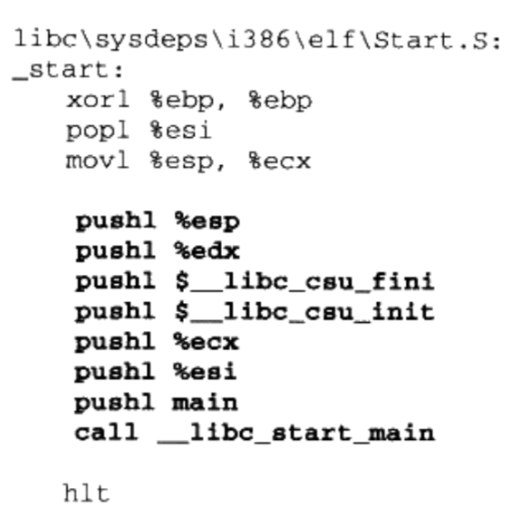
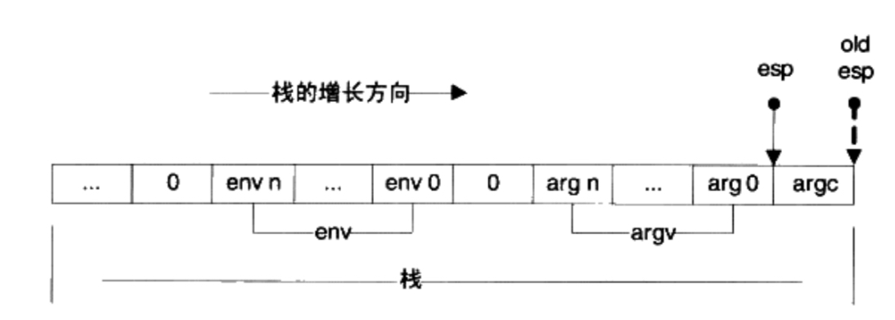
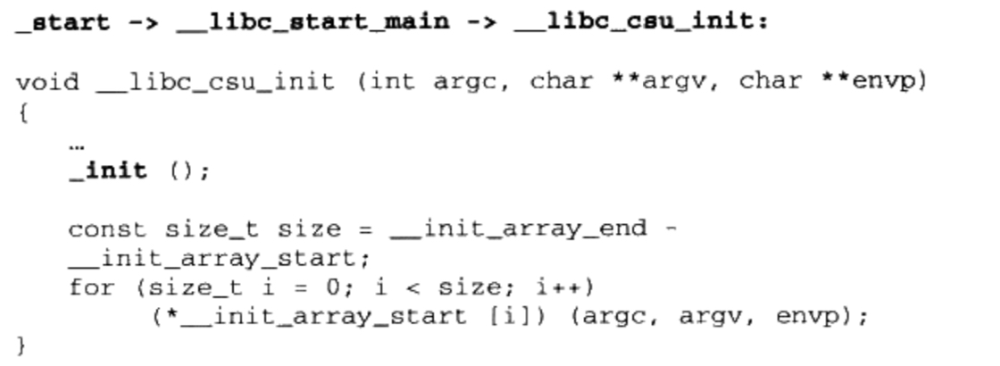
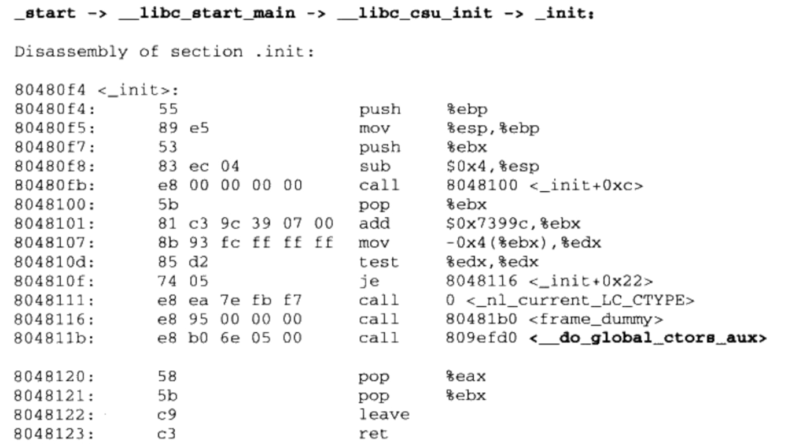
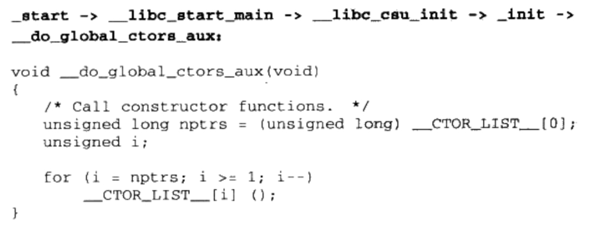

# 11. 运行库 

## 11.1 入口函数和程序初始化 

### 11.1.1 程序从main开始吗

操作系统装载程序后，首先运行的代码并不是main的第一行，而是某些别的代码，这些代码负责准备好main函数执行所需要的环境，并且负责调用main函数，这时候你才可以在main函数里放心大胆地写各种代码：申请内存，使用系统调用，触发异常，访问I/O。在main返回之后，它会记录main函数的返回值，调用atexit注册的函数，然后结束进程。

运行这些代码的函数叫做入口函数或入口点(Entry point)。程序入口点实际上是一个程序初始化和结束部分，它往往是运行库的一部分。一个典型的程序运行步骤如下：

- 操作系统在创建进程后，把控制权交到了程序的入口，这个入口往往是运行库中某个入口函数。
- 入口函数对运行库和程序运行环境进行初始化，包括堆，I/O，线程，全局变量构造，等。
- 入口函数在完成初始化后，调用main函数，正式开始执行程序的主体部分。
- main函数执行完毕后，返回到入口函数，入口函数进行清理工作，包括全局变量析构，堆销毁，关闭I/O等，然后进行系统调用结束进程。

### 11.1.2 入口函数如何实现

#### GLIBC入口函数

glibc启动过程在不同情况下，差别较大。静态glibc和动态glibc的差别，glibc用于可执行文件和用于共享库的差别，这些差别可以组合出4中情况。

后面讲述的都是静态/可执行文件链接的情况。

glibc的入口函数为_start(这个入口是由ld连接器默认的链接脚本所指定的，我们可以通过相关参数设定自己的入口)，_start由汇编实现，并和平台相关。

看i386实现(省略不重要的代码):



_start函数最终调用了名为__lib_start_main的函数，加粗的部分是对该函数的完整调用过程。其中开始的7个压栈指令用于给函数传递参数。在最开始的地方还有3个指令，它们的作用分别为：

- xor %ebp, %ebp: 这其实是让ebp寄存器清零。这样做的目的就是表面当前是程序的最外层函数。
- pop %esi 及 mov %esp, %ecx。 在调用_start函数之前，装载器会把用户的参数和环境变量压入栈中，按照其压栈的方法，实际上栈顶元素是argc，而接下来就是argv和环境变量的数组。下图是此时栈的布局。虚线箭头是执行pop %esi之前的栈顶(%esp)，而实线箭头是执行之后的栈顶(%esp)。



pop %esi将argc存入esi，而mov %esp, %ecx将栈顶地址（此时，就是argv和环境变量evn数组的起始地址）传给%ecx。现在%esi指向argc，%ecx指向argv和环境变量数组。

转为伪代码如下:

```C
void _start()
{
    %ebp = 0;
    int argc = pop from stack;
    char **argv = top of stack;
    __libc_start_main(main, argc, argv, __libc_csu_init, __libc_csu_fini, edx, top of stack);
}
```

### 11.1.3 运行库与I/O


## 11.2 C/C++运行库

### 11.2.1 C语言运行库 

一个C语言运行库大致包含了如下功能：

- 启动与退出：包括入口函数及入口函数所依赖的其他函数
- 标准函数：由C语言标准规定的C语言标准库所拥有的函数实现。
- I/O：I/O功能的封装与实现，参见上一节中I/O初始化部分
- 堆：堆的封装与实现，参见上一节堆的初始化部分
- 语言实现：语言中一些特殊功能的实现。
- 调试：实现调试功能代码

### 11.2.2 C语言标准库

C语言标准库非常轻量，包括：

- 标准输入输出(stdio.h)
- 文件操作(stdio.h)
- 字符操作(ctype.h)
- 字符串操作(string.h)
- 数学函数(math.h)
- 资源管理(stdlib.h)
- 格式转换(stdlib.h)
- 时间/日期(time.h)
- 断言(assert.h)
- 各种类型上的常数(limits.h & float.h)

除此之外C语言标准库还有一些特殊的库，用于执行一些特殊操作

- 变长参数(stdarg.h)
- 非局部跳转(setjmp.h)

#### 1. 变长参数


#### 2. 非局部跳转

### 11.2.3 glibc与MSVC CRT

## 11.3 运行库与多线程

### 11.3.1 CRT的多线程困扰

#### 线程访问权限

实际运行的线程拥有自己的私有存储空间

- 栈（尽管并非无法被其他线程访问，但一般情况下仍然可以认为是私有的数据）。
- 线程局部存储（Thread Local Storage， TLS）。线程局部存储是某些操作系统为线程单独提供的私有空间，但是通常只是具有很有限的尺寸。
- 寄存器（包括PC寄存器），寄存器是执行流的基本数据，因此为线程私有。

从C程序员角度：


| 线程私有  | 线程之间共享(进程所有) | 
| :------- | :----------------  | 
| 局部变量   | 全局变量           | 
| 函数的参数 | 推上的数据          |
| TLS数据   | 函数里的静态变量<br>程序代码，任何线程都有权力读取并执行任何代码<br>打开文件，A线程打开的文件可以由B线程读写|

#### 多线程运行库

C/C++运行库在多线程下的问题：

- (1) errno: 在C标准库里，大多数错误代码是在函数返回之前赋值在名为errno的全局变量里的。多线程并发的时候，有可能A线程的errno的值在获取之前就被B线程给覆盖了。
- (2) strtok()等函数都会使用函数内部的静态变量来存储字符串的位置，不同的线程调用这个函数将会把它内部的局部静态变量弄混。
- (3) malloc/new 与free/delete：堆分配/释放函数或关键字在不加锁的情况下是线程不安全的。由于这些函数或关键字的调用十分频繁，因此在保证线程安全的时候显得十分繁琐。
- (4) 异常处理：在早期的C++运行库里，不同的线程抛出异常会彼此冲突，从而造成信息丢失的情况。
- (5) printf/fprintf及其他I/O函数：流输出函数同样是线程不安全的，因为它们共享了同一个控制台或文件输出。不同的输出并发时，信息会混杂在一起。
- (6) 其他线程不安全因素：包括与信号相关的一些函数。

通常情况下，C标准库中在不进行线程安全保护的情况下自然地具有线程安全的属性的函数有（不考虑errno因素）：

- (1) 字符处理(ctype.h)，包括isdigit，toupper等，这些函数同时还是可重入的。
- (2) 字符串处理函数(string.h) 包括strlen，strcmp等，但其中涉及对参数中的数组进行写入的函数(如strcpy)仅在参数中的数组各不相同时，可以并发。
- (3) 数学函数(math.h)，包括sin， pow等，这些函数同时还是可重入的。
- (4) 字符串转整数/浮点数（stdlib.h)，包括atof, atoi, atol, strtod, strtol, strtoul。
- (5) 获取环境变量(stdlib.h), 包括getenv, 可重入
- (6) 变长数组辅助函数(stdarg.h)
- (7) 非局部跳转函数(setjmp.h)，包括setjmp和longjmp，前提是longjmp仅跳转到本线程设置的jumpbuf上。

### 11.3.2 CRT改进

#### 使用TLS

#### 加锁

#### 改进函数调用方式

### 11.3.3 线程局部存储实现

在一个线程中使用全局变量，且该全局变量只能在当前线程中可访问，这就需要线程局部存储(TLS, Thread Local Storage)。
对于GCC，加关键字__thread

    __thread int thread

对于MSVC，加关键字 __declspec(thread)

    __declspec(thread) int number

一旦一个全局变量被定义称TLS，那么每个线程都会拥有这个变量的副本，任何线程对这个变量的修改，都不会影响其他线程中，该变量的副本。


#### Windows中 TLS实现

#### 显式TLS

前面提到的__thread 和 __declspec(thread) 关键字方法为隐式TLS。编译器，运行库和操作系统负责处理变量申请，分配赋值和释放。

有显示的方法，通过调用函数来完成

linux:

    pthread_key_create()
    pthread_getspecific()
    pthread_setspecific()
    pthread_key_delete()

显示TLS使用TEB结构中的TLS数组保存TLS数据。TLS数组的元素数量固定，一般是64个，如果发现TLS数组使用完毕，会额外申请4096个字节作为二级TLS数组。显示TLS有很多限制，不推荐使用。


## 11.4 C++全局构造与析构

c++，入口函数还要在main函数的前后，完成全局变量的构造与析构。

### 11.4.1 glibc的全局构造与析构

elf文件中有.init和.fini两个段，这两个段中的代码会被拼成_init()和_finit()函数。这两个函数会先于/后于main函数执行。

```C
class HelloWorld
{
public:
    HelloWorld();
    ~HelloWorld();
};

HelloWorld Hw;

HelloWorld::HelloWorld()
{
    
}

HelloWorld::~HelloWorld()
{

}

int main()
{
    return 0;
}

```


_start函数传递的init函数指针实际指向了__libc_csu_init函数。这个函数位于Glibc源码中csu/Elf-init.c。


用户所有放在".init"段里的代码将在_init函数里执行。_init函数的实际内容并不定义在Glibc中，它是由各个输入目标文件中的".init"段拼接而成。

随便反汇编一个可执行文件，就可以发现_init


_init调用了__do_global_ctors_aux函数，这个函数不在Glibc代码里。而是在GCC提供的目标文件crtbegin.o的目标文件里。



__CTOR_LIST__中存放着所有全局对象的构造指针。


