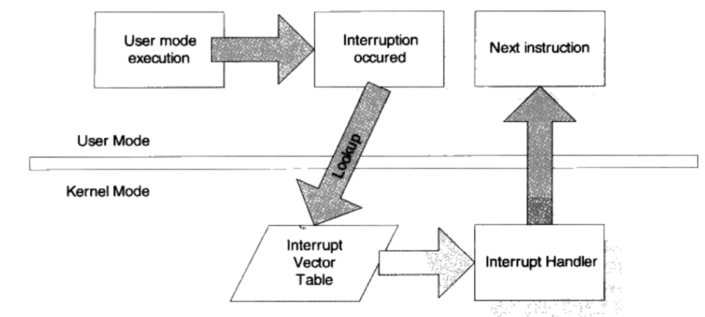
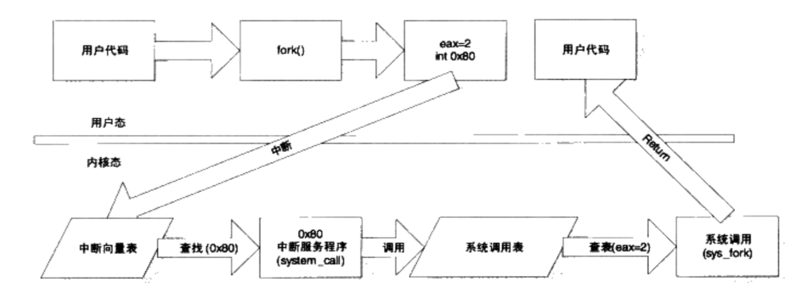
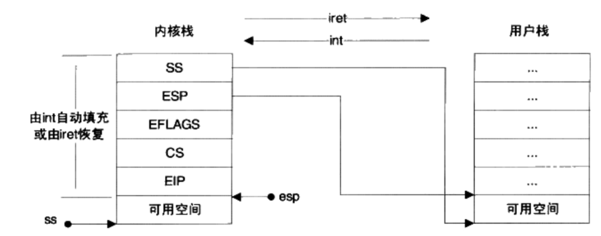
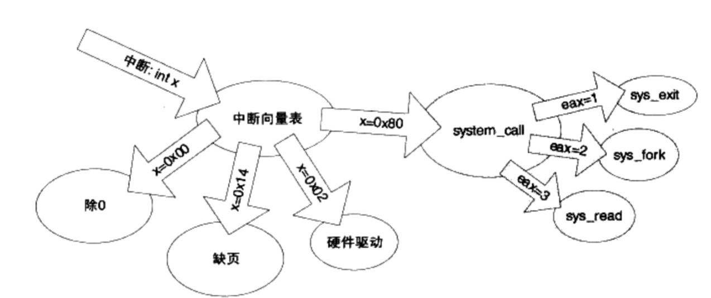
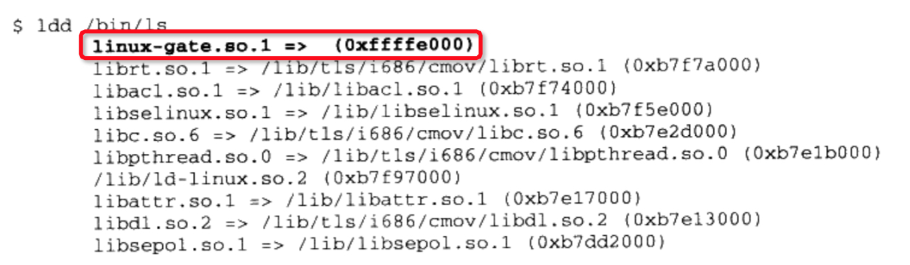
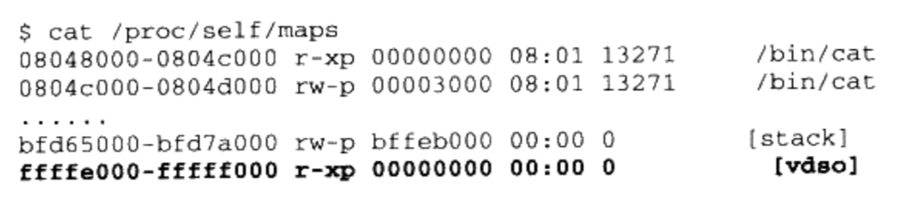
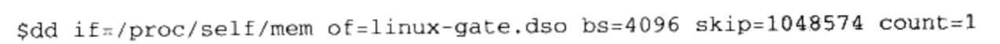
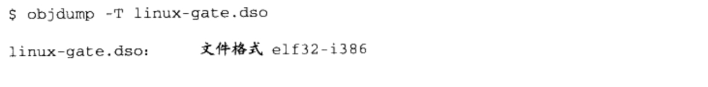
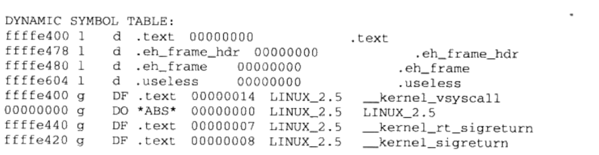
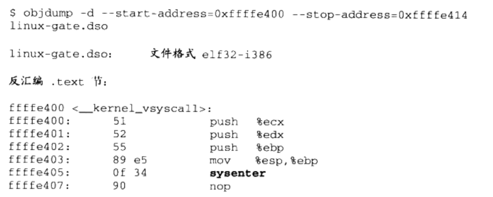

# 12. 系统调用和API 

## 12.1 系统调用介绍 

###  12.1.1 什么是系统调用  

每个操作系统都会提供一套接口，以供应用程序使用。这些接口往往通过中断实现。
Linux使用 0x80中断作为系统调用入口，Windows使用 0x2E中断作为系统调用入口。

### 12.1.2 Linux系统调用

Linux系统在x86构架下，系统调用由中断0x80完成，各个通用寄存器用于传递参数，EAX寄存器用于表示系统调用的接口号，比如EAX=1表示退出进程(exit)；EAX=2表示创建进程(fork)；EAX=3表示读取文件或I/O(read)；EAX=4表示写文件或I/O(write)。每个系统调用都对应于内核中的一个函数，它们都以sys_开头。当系统调用返回时EAX又作为调用结果的返回值。

Linux 2.6.19提供了319个系统调用，c语言形式提供在/usr/include/unistd.h中。

### 12.2.3 系统调用的弊端

大多数操作系统，包括linux都有以下特点

- 使用不方便。操作系统提供的系统调用接口往往比较原始，程序员需要了解很多与操作系统相关的细节。使用起来不方便。
- 各个操作系统之间系统调用不兼容。首先Windows系统和Linux系统之间的系统调用就基本上完全不同，虽然它们的内容很多都一样，但是定义和实现不大一样。

运行库就是为了解决这两个问题，它作为操作系统与应用程序之间的一个抽象层可以保持这样的特点:

- 使用简单。因为运行库本身是语言级的。它的设计一般比较友好。
- 形式统一。运行库有它的标准，叫做标准库，凡是所以遵循这个标准的运行库理论上都是互相兼容的，不会随着操作系统或编译器的变化二变化。

## 12.2 系统调用原理

### 12.2.1 特权级与中断 

现代操作系统通常有两种特权级别，用户模式(User Mode)和内核模式(Kernel Mode)，也被称为用户态和内核态。

操作系统一般通过中断(Interrupt)来从用户态切换到内核态。中断就是，软件或硬件触发CPU暂停，去执行更重要的东西。

中断一般有两个属性，一个称为中断号(从0开始)，另一个称为中断处理程序(Interrupt Service Routine，ISR)。中断向量表(Interrupt Vector Table)维护着中断号与中断处理程序的映射关系。

中断有两种，硬件中断和软件中断。
硬件中断来之硬件异常，某件事情发生如键盘被按下。
软件中断是一条指令。Linux  i386下 使用 int 0x80。

### 12.2.2 基于int的linux的经典系统调用实现

#### 1. 触发中断

通过宏

宏就是_syscallN(type,name,x...)，N是系统调用所需的参数数目，type是返回类型，name即面向用户的系统调用函数名，x...是调用参数，个数即为N。

    _syscall0
    _syscall1
    ...

#### 2. 切换栈

#### 3. 中断处理程序

### 12.2.3 linux 新型系统调用机制

linux-gate.so.1并不存在实际文件，它只是操作系统生成的一个虚拟动态共享库(Virtual Dynamic Shared Library, VDSO)，这个库总是被加载到0xffffe000的位置上。

地址0xffffe000-0xfffff000被映射了vdso，也就是linux-gate-.so.1，这个虚拟文件大小4096字节。可以将它导出：

使用objdump来查看文件

我们关心_kernel_vsyscall函数，这个函数负责新型系统调用。

反汇编查看：

**sysenter**

|          | 指令跳转，调用           |  数据访问        |
| :------- | :--------------------- | :------------  |
| 模块内部  | (1) 相对跳转和调用       | (2) 相对地址访问  |
| 模块外部  | (3) 间接跳转和调用(GOT)  | (4) 间接访问(GOT) |

