# 3. 目标文件里有什么

## 3.1 目标文件格式

pc平台可执行文件格式:

windows: PE(Portable Executable)
LINUX: ELF(Executable Linkale Format)

    都是COFF(Common File Format)的变种

目标文件格式:

Windows: .obj
LINUX: .o

| ELF文件类型 | 说明 | 实例 |
| :------------------------------- | :------ | :------ |
| 可重定位文件<br>(Relocatable File) | 这类文件包含了代码和数据，可以<br>被用来连接成可执行文件或者共享目标文件，静态链接库也可以归为这一类 | Linux的.o<br>Windows的.obj |
| 可重执行文件<br>(Executabel File) | 这类文件包含了可执行的程序，它<br>的代表就是ELF可执行文件，它们一般都没有扩展名。 | 比如/bin/bash文件<br>Windows的.exe |
| 共享目标文件<br>(Shared Object File) | 这类文件包含了代码和数据，可以<br>在一下两种情况使用，一种是连接器可以使用<br>这种文件跟其他的可重定位文件和共享目<br>标文件链接，产生新的目标文件。第二种<br>是动态链接器可以降几个这种共享目标文件与可只执行文件结合，作为进程映像的一<br>部分来运行 | Linux的.so<br>Windows的.DLL |
| 核心转储文件<br>(Core Dump File) | 当进程意外终止时，系统可以将该进程的地址<br>空间的内容及终时的一些其他信息转储到核心转储文件 | Linux的 core dump |

    LINUX下 file 指令查看格式

## 3.2 目标文件是什么样的

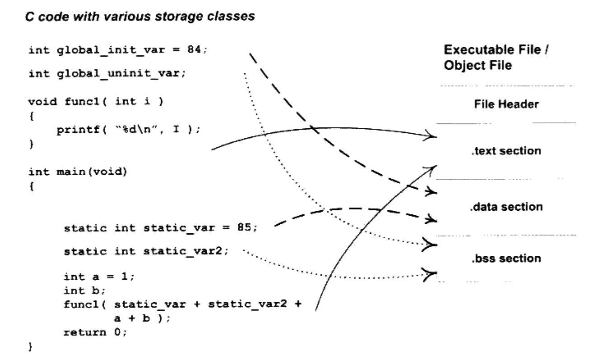

    C语言编译后，执行语句保存在.text段中，已初始化的全局变量和局部静态变量保存在.data段中。未初始化的全局变量和局部静态变量保存在.bss段中

## 3.3 挖掘SimpleSection.o

代码清单3-1

```c
/*
Linux:
    gcc -c SimpleSection.c

Windows:
    cl SimpleSection.c /c /Za
*/

int printf( const char * format, ...);

int global_init_var = 84;
int global_uninit_var;

void func1(int i)
{
    printf("%d\n", i);
}

int main(void)
{
    static int static_var = 85;
    static int static_var2;

    int a = 1;
    int b;

    func1(static_var + static_var2 + a + b);

    return a;
}

```

打印目标文件各段的基本信息-h，更多信息-x
$ objdump -h SimpleSection.o

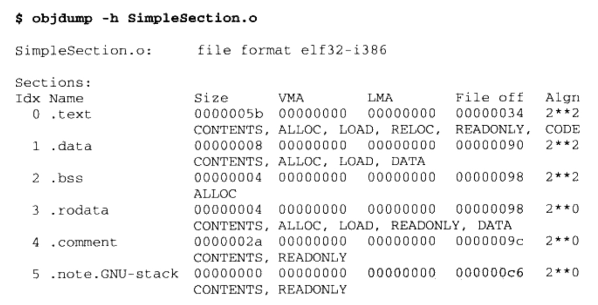

    .rodata 只读数据段
    .comment 注释信息段
    .note.GNU-stack 堆栈提示段


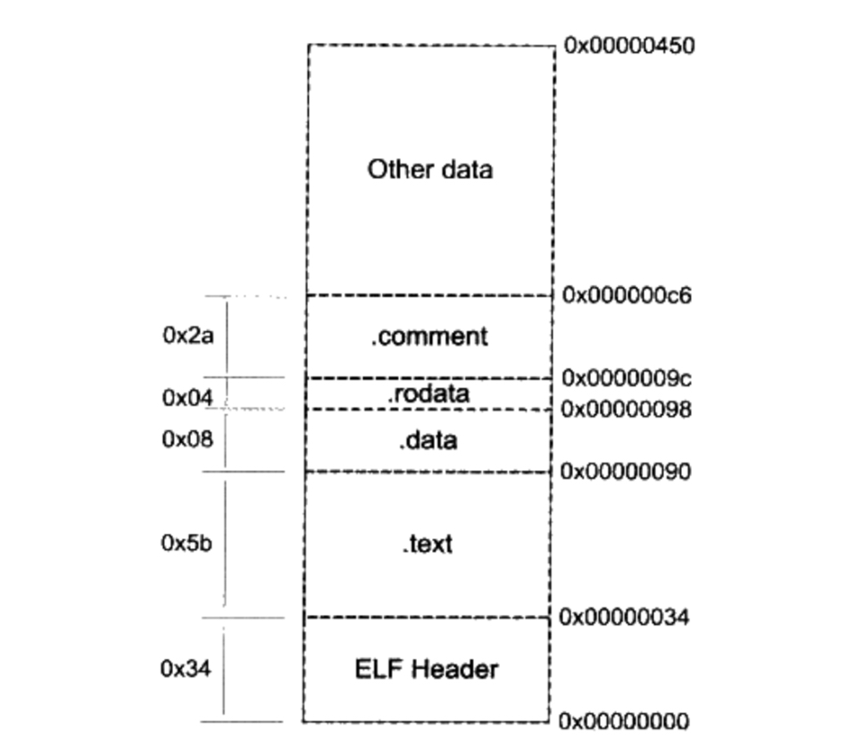

    size指令查看各段大小

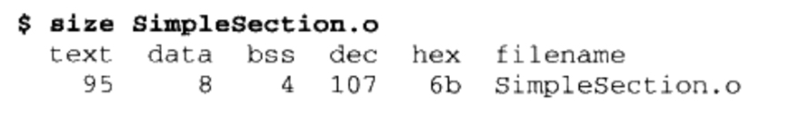

### 3.3.1 代码段

    objdump "-s"将所有内容以16进制打印出来，"-d"将所有包含指定的段反汇编

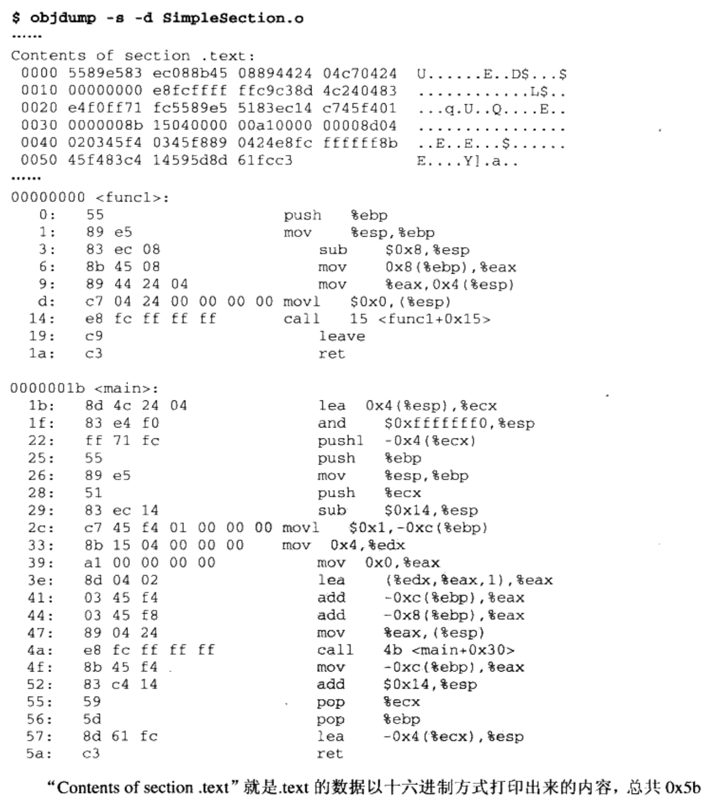

### 3.3.2 数据段和只读数据段

    .data 已经初始化的全局变量和局部静态变量，SimpleSection中global_init_var与static_var
    .rodata SimpleSection中调用printf的时候使用的字符串"%d\n"，程序中只读变量(const修饰变量) 和字符串常量

### 3.3.3 bss段

    .bss 存放未初始化全局变量和局部静态变量。 如：global_uninit_var和static_var2

    static int x1 = 0;
    static int x2 = 1;
    x1 会被优化存储在bss段

### 3.3.4 其他段

| 常用段名 | 说明 |
| :------------------------------- | :------ |
|.rodata1| Read Only Data，存放只读数据，比如字符串常量，全局<br>const变量。跟.rodata一样|
|.comment| 存放的是编译器版本信息，比如字符串："GCC: (GNU) 4.2.0"|
|.debug  | 调试信息|
|.dynamic| 动态链接信息|
|.hash   | 符号hash表|
|.line   | 调试时的行号表，即源代码行号与编译后指令的对应表|
|.note   | 额外编译器信息。比如程序的公司名，发布的版本号等|
|.strtab | String Table 字符串表。用户存储ELF文件中用到的各种字符串|
|.symtab | Symbal Table 符号表|
|.shstrtab | Section String Table 段名表|
|.plt<br>.got | 动态链接的跳转表和全局入口表|
|.init<br>.fini | 程序初始化与终结代码段。|

    可以自定义段

## 3.4 ELF文件结构描述

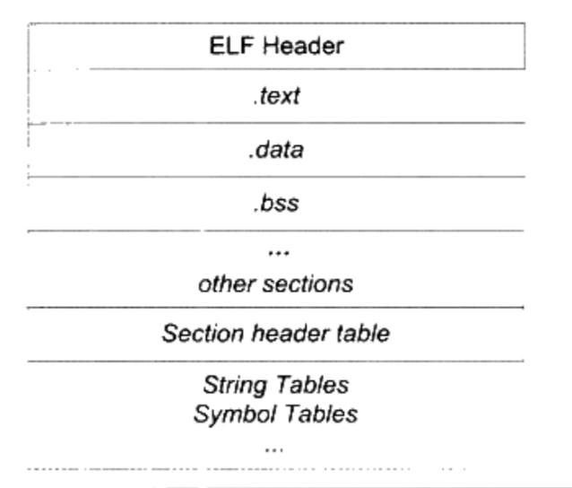

    段表(Section Header Table)，描述了ELF文件包含的所有段的信息，如段名，段的长度，在文件中的偏移，读写权限及段的其他属性。

### 3.4.1 文件头

查看文件头指令

readelf -h SimpleSection.o

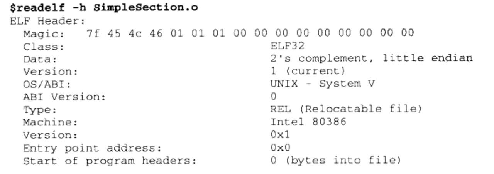
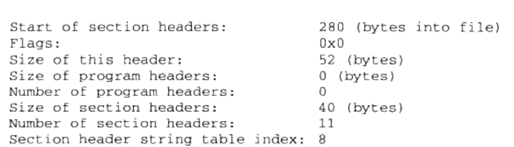

elf.h定义了一套自己的变量体系

| 自定义类型   | 描述 | 原始类型 | 长度(字节) |
| :---------- | :----------------- | :------- | :--- |
| Elf32_Addr  | 32位版本程序地址     | uint32_t | 4  |
| Elf32_Half  | 32位版本无符号短整型  | uint16_t | 2  |
| Elf32_Off   | 32位版本偏移地址     | uint32_t | 4  |
| Elf32_Sword | 32位版本有符号整型   | int32_t  | 4  |
| Elf32_Word  | 32位版本无符号整型   | uint32_t | 4  |
| Elf64_Addr  | 64位版本程序地址     | uint64_t | 8  |
| Elf64_Half  | 64位版本无符号短整型  | uint16_t | 2  |
| Elf64_Off   | 64位版本偏移地址     | uint64_t | 8  |
| Elf64_Sword | 64位版本有符号整型   | int32_t  | 4  |
| Elf64_Word  | 64位版本无符号整型   | uint32_t | 4  |  

头文件定义如下:

```c
typedef struct {
	unsigned char	e_ident[EI_NIDENT];	/* File identification. */
	Elf32_Half	e_type;		/* File type. */
	Elf32_Half	e_machine;	/* Machine architecture. */
	Elf32_Word	e_version;	/* ELF format version. */
	Elf32_Addr	e_entry;	/* Entry point. */
	Elf32_Off	e_phoff;	/* Program header file offset. */
	Elf32_Off	e_shoff;	/* Section header file offset. */
	Elf32_Word	e_flags;	/* Architecture-specific flags. */
	Elf32_Half	e_ehsize;	/* Size of ELF header in bytes. */
	Elf32_Half	e_phentsize;	/* Size of program header entry. */
	Elf32_Half	e_phnum;	/* Number of program header entries. */
	Elf32_Half	e_shentsize;	/* Size of section header entry. */
	Elf32_Half	e_shnum;	/* Number of section header entries. */
	Elf32_Half	e_shstrndx;	/* Section name strings section. */
} Elf32_Ehdr;

```

头文件成员含义


| 成员   | readelf 输出结果与含义 |
|:------ | :-------------------|
| e_ident| Magic: 7f 45 4c 46 01 01 01 00 00 00 00 00 00 00 00 00<br> Class: ELF32<br> Data: 2's complement, little endian<br> Version: 1(current) <br>OS/ABI: UNIX - System V<br> ABI Version: 0|
| e_type | Type: REL(Relocatable file) <br> ELF文件类型|
| e_machine | Machine: Intel 80386 <br> ELF文件的CPU平台属性，相关常量以EM_开头|
| e_version | Version: 0x1 <br> ELF版本号一般位1|
| e_entry | Entry point address: 0x00 <br> 入口地址，规定ELF程序的入口虚拟地址，操作系统在加载完该程序之后<br>从这个地址开始执行进程指令。可重定位文件一般没有入口地址，则这个<br>值位0|
| e_phoff | Start of program headers: 0 (bytes into file) <br> 参考后面的“ELF链接视图和执行视图”|
| e_shoff | start of section headers: 280(bytes into file) <br> 段表在文件中的偏移|
| e_word | flag: 0x0 <br> ELF标志位，用来标识ELF文件平台相关的一些属性，相关常量的格式一般为EF_machine_flag，machine为平台，flag为标志|
| e_ehsize | Size of this header: 52(bytes) <br> 即ELF文件头本身的大小|
| e_phentsize | Size of program headers: 0(bytes) <br>参考后面的“ELF链接视图和执行视图”|
| e_phnum | Number of program headers: 0(bytes) <br>参考后面的“ELF链接视图和执行视图”|
| e_shentsize | Size of section headers: 40(bytes) <br>段表描述符大小，这个一般等于sizeof(Elf32_Shdr)。参考段表|
| e_shnum | Number of section headers: 11 <br>段描述符数量。这个值等于ELF文件中拥有的段的数量|
| e_shstrndx | Section header string table index: 8 <br>段表字符串表所在的段在段表中的下标|

#### ELF魔数

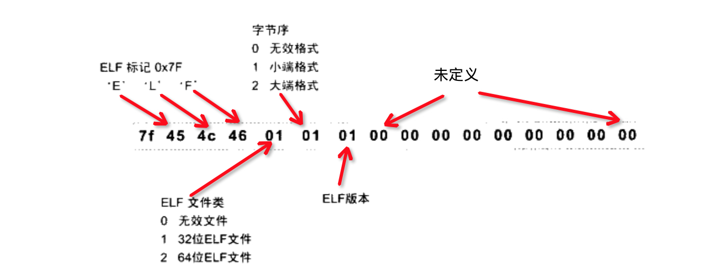

#### 文件类型

e_type 表示文件类型，相关常量以"ET_"开头

| 常量       | 值   | 含义       |
|:------    | :----- | :------- |
| ET_NONE   | 0      | No file type |
| ET_REL    | 1      | 可重定位文件，一般以.o结尾 |
| ET_EXEC   | 2      | 可执行文件 |
| ET_DYN    | 3      | 共享目标文件，一般为.so文件 |
| ET_CORE   | 4      | core file |
| ET_LOOS   | 0xfe00 | Operating system-specific |
| ET_HIOS   | 0xfeff | Operating system-specific |
| ET_LOPROC | 0xff00 | Processor-specific |
| ET_HIPROC | 0xffff | Processor-specific |

#### 机器类型

e_machine 表示ELF文件的平台属性

| 常量       | 值   | 含义       |
|:------    | :----- | :------- |
| EM_NONE   | 0      | No machine |
| EM_M32    | 1      | AT&T WE 32100 |
| EM_SPARC  | 2      | SPARC |
| EM_386    | 3      | Intel 80386 |

### 3.4.2 段表

段表用于保存各段的基本的基本属性，如：段名，段长度，在文件中的偏移，读写权限及段的其他属性
编译器，连接器和装载器都是通过段表来定位和访问各个段的属性。段表的位置由"e_shoff"成员确定。

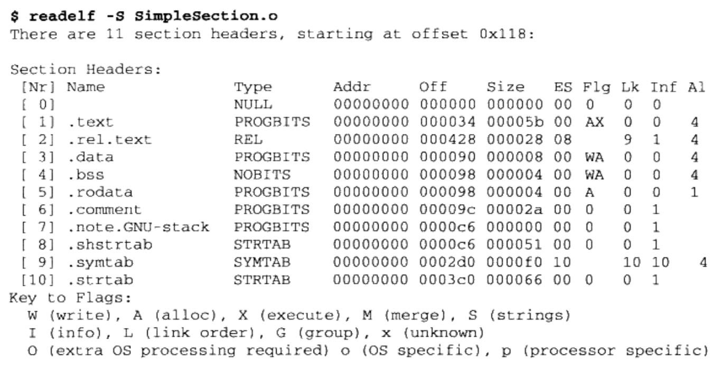

    段表就是以结构体Elf32_Shdr为元素的数组。
    图中，第0个元素类型为NULL，表示无效的段描述符。

Elf32_Shdr 定义的结构
```c
typedef struct elf32_shdr {
  Elf32_Word	sh_name;
  Elf32_Word	sh_type;
  Elf32_Word	sh_flags;
  Elf32_Addr	sh_addr;
  Elf32_Off	sh_offset;
  Elf32_Word	sh_size;
  Elf32_Word	sh_link;
  Elf32_Word	sh_info;
  Elf32_Word	sh_addralign;
  Elf32_Word	sh_entsize;
} Elf32_Shdr;
````


| 成员       | 含义          |
|:------    | :------------  |
| sh_name   | Section name 段名 <br>段名是字符串，它位于一个叫做“.shstrtab”的字符串表。sh_name是段名字符串在“.shstrtab”中的偏移|
| sh_type   | Section type 段类型 |
| sh_flags  | Section flag 段的标志 |
| sh_addr   | Section address 段的虚拟地址 <br> 如果该段可以被加载，则sh_addr为该段被加载后在进程地址空间中的虚拟地址；否则sh_addr为0|
| sh_offset | Section offset 段偏移 <br> 如果该段位于文件中，则表示该段在文件中的偏移；否则无意义。比如，sh_offset对于bss无意义。|
| sh_size   | Section size 段的长度 |
| sh_link和<br>sh_info | Section Link and Section Information 段链接信息 |
| sh_addralign | Section Address Alignment 段地址对齐<br> 有些段对段地址对齐有要求，比如我们假设有个段刚开始的位置包含了一个double变量，因为Intel x86系统要求浮点数的存储地址必须是本身的整数倍，也就是说，它的sh_addr必须是8的倍数。由于地址对齐数量都是2的指数倍，sh_addralign表示地址对齐数量中的指数，即sh_addralign=3表示对齐为2的3次方，即8倍，以此类推。所以一个段的地址必须满足下面的条件，即sh_addr %(2**sh_addralign) = 0。**表示指数运算。如果sh_addralign为0或1，表示该段没有对齐要求。|
| sh_entsize | Section Entry size 项的长度 <br> 有些段包含了一些固定大小的项，比如符号表，它包含的每个符号所占的大小都是一样的。对于这种段，sh_entsize表示每个项的大小。如果为0，则表示该段不包含固定大小的项
|

#### 段的类型

sh_type，段的类型以"SHT_"开头。

| 常量            | 值     | 含义        |
|:-------------  | :----- | :------- |
| SHT_NULL       | 0      | 无效段    |
| SHT_PROGBITS   | 1      | 程序段。代码段，数据段都是这种类型  |
| SHT_SYMTAB     | 2      | 表示该段的内容为符号表  |
| SHT_STRTAB     | 3      | 表示该段的内容为字符串  |
| SHT_RELA       | 4      | 重定位表。该段包含了重定位信息，具体参考“静态地址决议和重定位”这一节  |
| SHT_HASH       | 5      | 符号表的哈希表  |
| SHT_DYNAMIC    | 6      | 动态链接信息    |
| SHT_NOTE       | 7      | 提示信息    |
| SHT_NOBITS     | 8      | 表示该段在文件中没有内容，比如.bss    |
| SHT_REL        | 9      | 该段包含了重定位信息，具体参考“静态地址决议和重定位”这一节 |
| SHT_SHLIB      | 10     | 保留 |
| SHT_DNYSYM     | 11     | 动态链接的符号表 |

#### 段的标志位

sh_flags 表示该段在进程虚拟地址空间中的属性，比如是否可写，是否可执行。以"SHF_"开头。

| 常量            | 值     | 含义        |
|:-------------  | :----- | :------- |
| SHF_WRITE      | 1      | 该段在进程中可写 |
| SHF_ALLOC      | 2      | 该段在进程中要分配空间。有些包含指示或控制信息的段不需要在进程空间中被分配空间，它们一般不会有这个标志。代码段，数据段，bss段都会有这个标志 |
| SHF_EXECINSTR  | 4      | 该段在进程中可执行。一般指代码段。 |
| SHF_RELA_LIVEPATCH | 0x00100000   |  |
| SHF_RO_AFTER_INIT  | 0x00200000   |  |
| SHF_MASKPROC       | 0xf0000000   |  |

系统保留段，属性表

| Name        | sh_type      |  sh_flag              |
|:----------- | :----------- | :-------------------- |
|.bss         | SHT_NOBITS   | SHF_ALLOC + SHF_WRITE |
|.commnet     | SHT_PROGBITS | none |
|.data        | SHT_PROGBITS | SHF_ALLOC + SHF_WRITE |
|.data1       | SHT_PROGBITS | SHF_ALLOC + SHF_WRITE |
|.debug       | SHT_PROGBITS | none |
|.dynamic     | SHT_DYNAMIC  | SHF_ALLOC + SHF_WRITE<br>在有些系统下.dynamic可能是只读的，所以没有SHF_WRITE标志|
|.hash        | SHT_HASH     | SHF_ALLOC |
|.line        | SHT_PROGBITS | none |
|.note        | SHT_NOTE     | none |
|.rodata      | SHT_PROGBITS | SHF_ALLOC |
|.rodata1     | SHT_PROGBITS | SHF_ALLOC |
|.shstrtab    | SHT_STRTAB   | none |
|.strtab      | SHT_STRTAB   | 如果该ELF文件中有可装载的段需要用到该字符串表，那么该字符串表也将被装载到进程空间，则有SHF_ALLOC标志 |
|.symtab      | SHT_SYMTAB   | 同字符串表 |
|.text        | SHT_PROGBITS | SHF_ALLOC + SHF_EXECINSTR |

#### 段的链接信息(sh_link, sh_info)

如果段的类型是与链接相关的（无论是动态链接或静态链接），如重定位表，符号表。其他类型，没有意义

| sh_type     |        sh_link             |  sh_info              |
|:----------- | :------------------------- | :-------------------- |
| SHT_DYNAMIC | 该所使用的字符串表在段表中的下标|  0 |
| SHT_HASH    | 该所使用的符号表在段表中的下标  |  0 |
| SHT_REL<br> SHT_RELA   | 该所使用的相应符号表在段表中的下标  | 该重定位表所作用的段在段表中的下标 |
| SHT_SYMTAB<br> SHT_DYNSYM   | 操作系统相关  | 操作系统相关 |
| other   | SHN_UNDEF  | 0 |

### 3.4.3 重定位表

类型为 SHT_REL，对于SimpleScetion.o，".rel.text"就是针对".text"段的重定位表，因为".text"中包含对"printf"函数的引用。".data"没有需要重定位的，所以没有".rel.data"表
"sh_link"表示符号表的下标，它的"sh_info"表示作用于哪一个段。

### 3.4.4 字符串表

字符串长短不一，可以把字符串都集中起来，通过偏移来引用字符串。
.strtab   : 字符串表(String Table)
.shstrtab : 段表字符串表(Section Header String Table)

ELF文件头中 "e_shstrndx"是Section header string table index 缩写。"e_shstrndx"表示".shstrtab"在段表中的下标。

## 3.5 链接的接口——符号

在链接中，函数和变量统称为符号(Symbol)，函数名和变量名就是符号名(Symbol Name)
每一个目标文件都会有个符号表(Symbol Table)，记录了目标文件中所有的符号。
每个符号都有一个对应的值，符号值(Symbol Value)，对于函数和变量来说，就是地址。

* 定义在目标文件的全局符号，可以被其他目标文件引用。"func1"，"main"，"global_init_var" 
* 在目标文件中引用的全局符号，没有在本目标文件中定义，一般叫做外部符号"Extermal Symbol"，如"printf"
* 段名，由编译器产生，它的值就是该段的起始地址。".text"，".data"
* 局部符号，在编译单元内部可见。"static_var"，"static_var2"，调试器可以使用这些符号来分析程序崩溃时的core dump文件。这些局部符号对链接过程没有用，连接器忽略它们。
* 行号信息。目标文件指令于代码行对应的关系。可选。

使用nm查看符号:
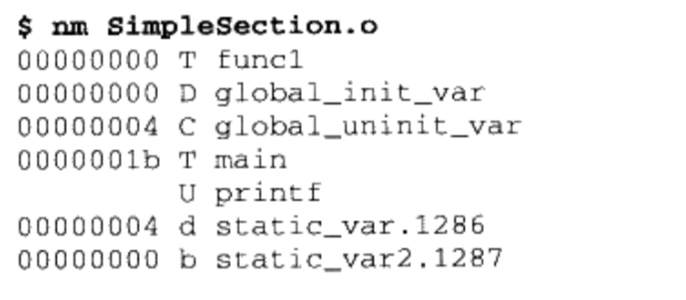

### 3.5.1 ELF符号表结构

ELF符号表是一个段，段名为".symtab"。
符号表是一个Elf32_Sym结构体的数组。这个数组的第一个元素即下标为0的元素，是无效的未定义符号。

```c
typedef struct
{
    Elf32_Word    st_name;                /* Symbol name (string tbl index) */
    Elf32_Addr    st_value;               /* Symbol value */
    Elf32_Word    st_size;                /* Symbol size */
    unsigned char st_info;                /* Symbol type and binding */
    unsigned char st_other;               /* Symbol visibility */
    Elf32_Section st_shndx;               /* Section index */
} Elf32_Sym;
```

| 成员            | 含义                          |
| :--------      | :-----------------------------|
| st_name        | 符号名。该符号名在字符串表中的下标。| 
| st_value       | 符号对应值。和符号相关，可能是一个绝对值，也可能是一个地址值，不同的符号对应的值的含义不同| 
| st_size        | 符号大小。对于包含数据的符号，这个值是该数据的类型的大小。比如一个double型符号，占据8个字节。如果值为0，则表示该符号大小为0或未知。| 
| st_info        | 符号类型和绑定信息| 
| st_other       | 为0，无用| 
| st_shndx       | 符号所在的段| 

#### 符号类型和绑定信息

st_info 低4位表示符号类型(Symbol type)，高28位表示绑定信息(Symbol binding)。

符号绑定信息

| 宏定义       | 值   | 说明 |
| :---------- | :-- | :--- |
| STB_LOCAL   | 0   | 局部符号，目标文件的外部不可见 |
| STB_GLOBAL  | 1   | 全局符号，外部可见 |
| STB_WEAK    | 2   | 弱引用，详见“若符号与强符号” |

符号类型

| 宏定义       | 值   | 说明 |
| :---------- | :-- | :--- |
| STT_NOTYPE  | 0   | 未知类型 |
| STT_OBJECT  | 1   | 数据对象，比如数组，变量 |
| STT_FUNC    | 2   | 函数或其他可执行代码 |
| STT_SECTION | 3   | 该符号是一个段，这种符号必须是STL_LOCAL |
| STT_FILE    | 4   | 该符号表示一个文件名，一般是该目标文件所对应的原文件名，<br> 它一定是STB_LOCAL的，并且它的st_shndx一定是SHN_ABS|

#### 符号所在的段

st_shndx
该符号定义在本目标文件中：该符号所在段在段表中的下标。
该符号定义不在本目标文件中：值有些特殊。

| 宏定义       | 值       | 说明 |
| :---------- | :------- | :--- |
| SHN_ABS     | 0xfff1   | 表示该符号包含了一个绝对值。比如表示文件名的符号就属于这种类型。 |
| SHN_COMMON  | 0xfff2   | 表示该符号是一个"COMMON块"类型的符号，一般来说，未初始化的全局符号定义就是这种类型，如SimpleSection.o中的global_uninit_var。详见：“深入静态链接”之“COMMON块” |
| SHN_UNDEF   | 0        | 表示该符号未定义，该符号在本目标文件中被引用，但是定义在其他目标文件中。 |

#### 符号值

* 目标文件中，如果是符号的定义并且该符号不是"COMMON块"类型的(即st_shndx不是SHN_COMMON)，则st_value表示符号在段中的偏移。即符号所对应的函数或变量位于由st_shndx指定的段，偏移st_value的位置。如SimpleSection.o中的"func1", "main"和"global_init_var"。
* 目标文件中，如果符号是"COMMON块"类型，st_value表示该符号的对齐属性。比如SimpleSection.o的"global_uninit_var"。
* 在可执行文件中，st_value表示符号的虚拟地址。

readefl查看符号更清晰。
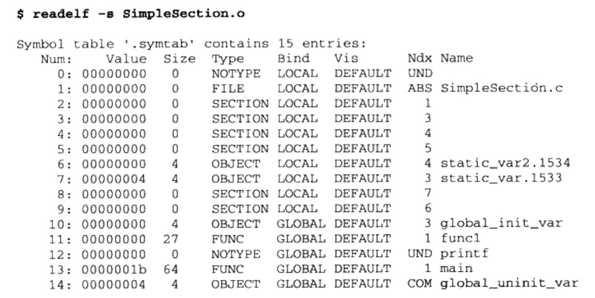

第一列，符号表下标

第二列，符号值，st_value

第三列，size，符号大小

第四列，第五列，符号类型和绑定信息。st_info的低4位和高28位。

第六列，暂时忽略

第七列，st_shndx，符号所属的段。

第八列，符号名。

* func1和main的Ndx为1，.text在段表的下标为1。它们是函数所以，类型是：STT_FUNC；它们是全局可见的，所以是STB_GLOBAL；Size表示函数指令占的字节数；Value函数相对代码起始位置的偏移量。
* printf在目标文件中被引用，但没有定义。所以它的的Ndx是SHN_UNDEF
* global_init_var是已初始化的全局变量，它被定义在.data段里，即下标3。
* global_uninit_var是为初始化全局变量，它是一个SHN_COMMON类型符号。它本身并没有存在于BSS段，具体参考"COMMON块"
* static_var.1533和static_var2.1534是两个静态变量，绑定属性是：STB_LOCAL，即编译单元内可见。
* 那些STT_SECTION类型的符号，它们表示下标为Ndx的段的段名。它们的符号名没有显示，其实它们的符号即是它们的段名。
* "SimpleSection.c"这个符号表示编译单元的源文件。

### 3.5.2 特殊符号

使用ld链接程序时，会额外产生没有在文件中定义的符号。你可以申明使用它们。

* __executable_start 程序起始地址，不是入口地址，是程序最开始的地址。
* __etext或_etext或etext，代码结束地址，即代码段最末尾地址。
* _edata或edata，数据段结束地址，即数据段最末尾地址。
* _end或end，程序结束地址。
* 以上都是程序装载时的虚拟地址。

我们可以直接在代码中使用这些符号

```c
/*
    SpecialSymbol.c

    gcc SpecialSymbol.c -o SpecialSymbol
*/

#include <stdio.h>

extern char __executable_start[];
extern char etext[], _etext[], __etext[];
extern char edata[], _edata[];
extern char end[], _end[];

int main(){
    printf("Executable Start: %X\n", __executable_start);
    printf("Text End: %X  %X  %X\n", etext, _etext, __etext);
    printf("Data End: %X  %X\n",edata, _edata);
    printf("Executable End: %X  %X\n", end, _end);
}
```

### 3.5.3 符号修饰与函数签名

最开始汇编定义了一些符号，比如foo函数。后来新发明的语言如C语言，要调用这些汇编库函数，就不能使用这些符号名，否则会冲突。为了防止冲突，Unix下的C语言规定，编译后，相应的符号前加下划线"_"，而"Fortran"则在前后都加下划线"_"。如foo函数，C语言编译后为"_foo"，Fortran语言编译后为"_foo_"。后来，C++又增加命名空间"Namespace"，来解决冲突。

但目前，linux gcc已经去掉了在C语言前面加"_"的。gcc可以使用选项，-fleading-underscore，-fno-leading-undersocre，来打开和关闭C语言符号前下划线。

#### C++符号修饰

为了应付C++复杂特性，发明了符号修饰(Name Decoration)和符号改编(Name Mangling)的机制

C++函数名称修饰
```C++
int func(int);
float func(float);

class C {
    int func(int);
    class C2 {
        int func(int);
    };

};

namespace N{
    int func(int);
    class C {
        int func(int);
    };
}

```

函数签名(Function Signature)，函数签名包含了一个函数的信息，包括函数名，它的参数类型，它所在的类和命名空间及其他信息。在编译器及连接器处理符号时，它们使用某种名称修饰方法，使得每个函数签名对应一个修饰后的名称(Decorated Name)。

| 函数签名             | 修饰后的名称(符号名)  | 
| :-------------------- | :---------------|
| int func(int)         | _Z4funci        |
| float func(float)     | _Z4funcf        |
| int C::func(int)      | _ZN1C4funcEi    |
| int C::C2::func(int)  | _ZN1C2C24funcEi |
| int N::func(int)      | _ZN1N4funcEi    | 
| int N::C::func(int)   | _ZN1N1C4funcEi  | 

c++filt 工具可以用来解析被修饰过的名称
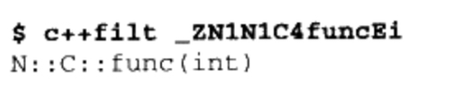

全局变量和静态变量也有同样的机制，比如名称空间foo中全局变量bar，它的修饰后名字为：_ZN3foo3barE。注意，变量没有类型信息，所以无论变量是整型或浮点，甚至是一个全局对象，它的名称都是一样的。

### 3.5.4 extern "C"

为了兼容 C++ 和 C，C++引入一个“extern"C"“关键字

```C
extern "C"{
    int func(int);
    int var;
}
```

C++编译器会将extern “C”括号内的代码当作C语言处理。
也可以单独申明

```c
extern "C" int func(int);
extern "C" int var;
```

### 3.5.5 弱符号与强符号

对C/C++语言来说，编译器默认，函数和初始化了的全局变量为强符号，未初始化的全局变量为弱符号。也可以通过GCC的"\_\_attribute\_\_((weak))"来定义任何一个强符号为弱符号。强符号弱符号都是针对定义来说的，而不是针对引用。

```C
extern int ext;

int weak;
int strong = 1;

__attribute__((weak)) weak2 = 2

int main()
{
    return 0;
}

```

weak和weak2都是弱符号，strong和main都是强符号。ext既非强符号也非弱符号，是一个对外部变量的引用。

* 规则1: 不允许强符号被多次定义，即不同的目标文件中不能有相同的强符号。连接器会报重复定义的错误。
* 规则2: 如果一个符号在某个目标文件中是强符号，在其他文件中都是弱符号，那么选择强符号。
* 规则3: 如果一个符号在所有文件中都是若符号，选择占用空间最大的一个。如目标文件A，定义全局变量global为int，占4个字节，目标文件B，定义全局变量global为double，占8个字节。在A和B链接时，符号global占8个字节。

#### 弱引用和强引用

强引用(Strong Reference)：目标文件引用了外部符号，在链接时若未找到定义则报错；则对该外部符号的引用为强引用

弱引用(Weak Reference)：目标文件引用了外部符号，在链接时若未找到定义也不报错；则对该外部符号的引用为弱引用

可以使用"\_\_attribute\_\_((weakref))"申明一个外部函数为弱引用

```c
__attribute__((weakref)) void foo();


int main()
{
    foo();
}
```

可以编译通过，但是运行时会crash。因为foo的地址为0。

```c
__attribute__((weakref)) void foo();

int main()
{
    if (foo)
    {
        foo();
    }
}
```
这就不会crash，如果找不到foo，就不运行。


## 3.6 调试信息

在编译的时候，加上-g。通过readelf可以发现，很多"debug"相关的段。

ELF文件采用，DWARF(Debug With Arbitrary Record Format)的标准的调试信息格式。

strip可以去掉调试信息。

strip foo


