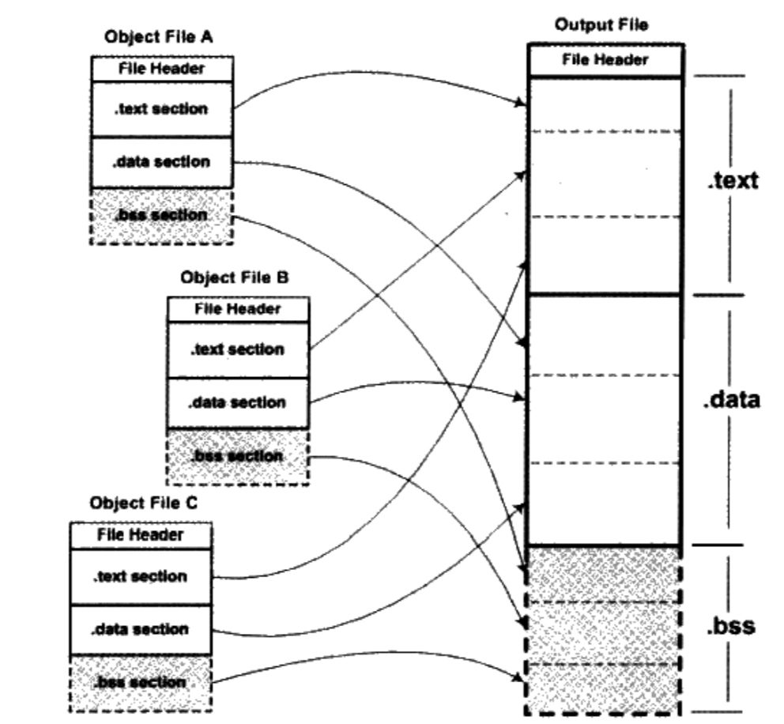
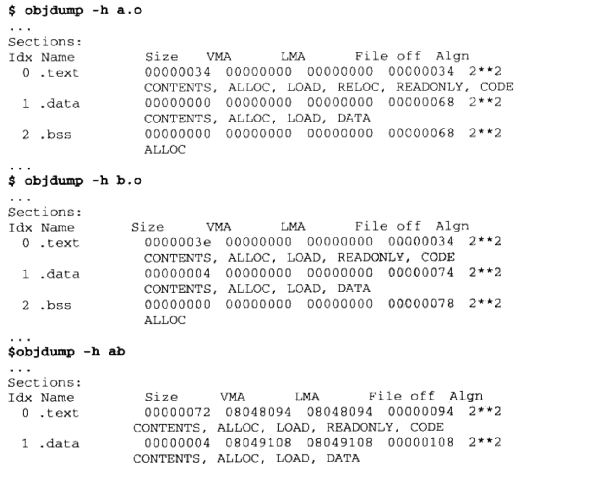
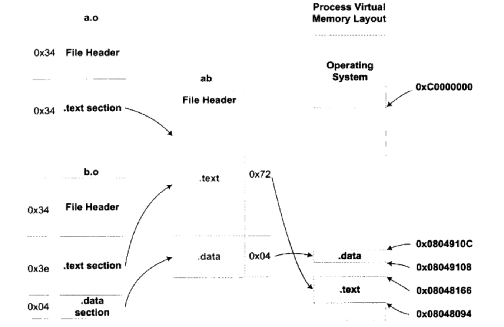
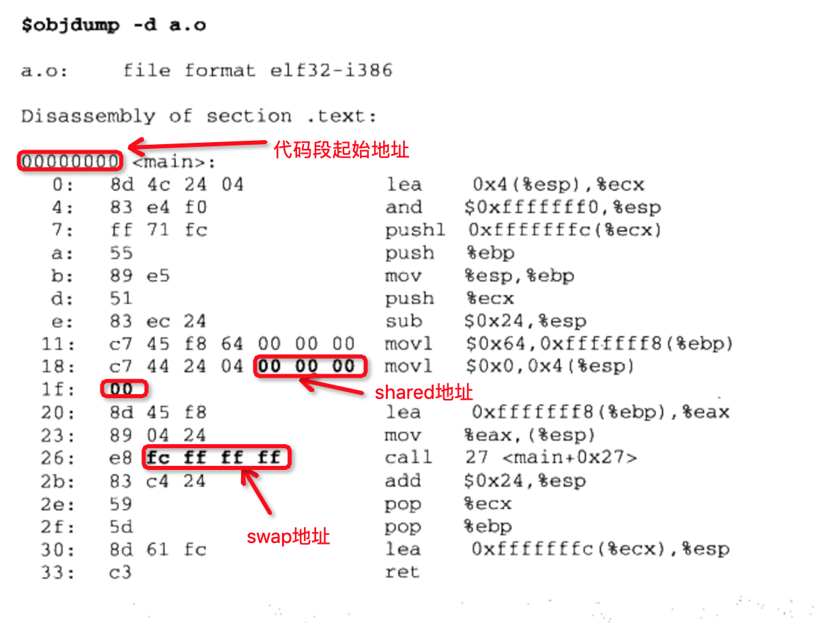
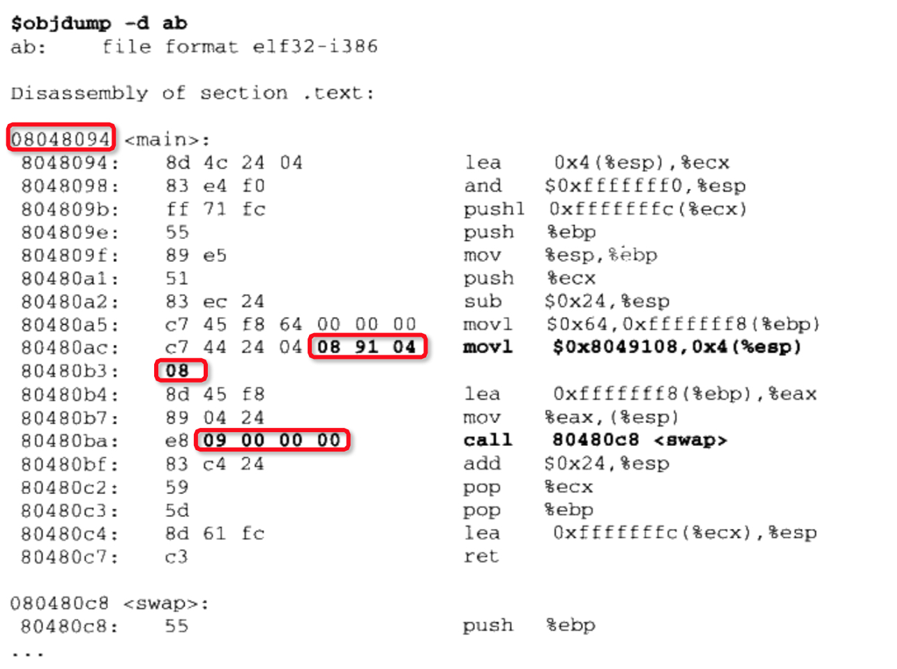
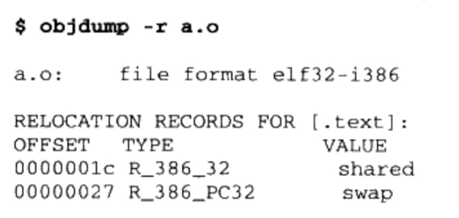
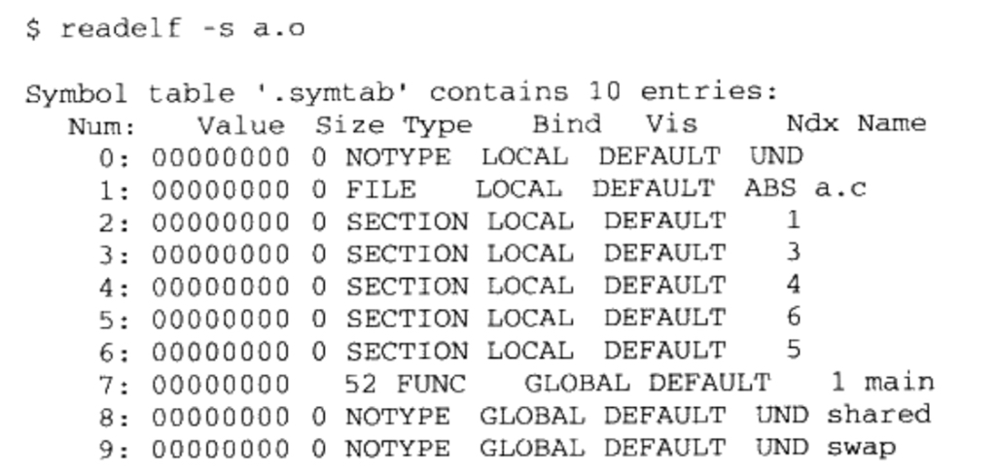

# 4. 静态链接 

例子代码a.c和b.c

```c
/*
a.c
*/
extern int shared;

int main()
{
    int a = 100;
    swap(&a, &shared);
}

```

```c
/**
b.c
**/
int shared = 1;
void swap(int * a, int * b)
{
    *a ^= *b ^= *a ^= *b;
}

```

gcc -c a.c b.c


## 4.1 空间与地址分配 

### 4.1.1 按序叠加

不是喊得方法。

### 4.1.2 相似段合并



两步链接的方法(Two-pass Linking)

* 第一步：空间与地址分配  扫描所有的输入目标文件，并且获得它们的各个段的长度、属性和位置，并且将输入目标文件中的符号表中所有的符号定义和符号引用收集起来，统一放到一个全局符兮表。这一步中，链接器将能够获得所有输入冃标文件的段长度，并且将它们合并，计算出输出文件屮各个段合并后的长度与位置，并建立映射关系。

* 第二步：符号解析与重定位 使用上面第一步中收集到的所有信息，读取输入文件中段的数裾、重定位信息，并且进行符号解析与重定位、调整代码中的地址等。事实上第二步是链接过程的核心，特别是重定位过程

ld a.o b.o -e main -o ab

* -e main 表示将main函数作为程序入口，ld连接器默认的程序入口为_start。
* -o ab 表示链接输出文件名为：ab，默认为a.out

链接前后，各段属性


    VMA 表示 Virtual Memory Address，即虚拟地址。LMA 表示 Load Memory Address，即加载地址。正常情况下，两者是一样的，但在某些嵌入式系统中，特别是那些程序放在ROM的系统中时，LMA和VMA是不同的。这里关注VMA即可。





### 4.1.3 符号地址确定

## 4.2 符号解析与重定位

### 4.2.1 重定位

静态链接的核心内容，连接器的符号解析和重定位。



未进行分配前，目标文件代码段起始地址未0x00000000。
shared地址位置未定位之前设为0。
swap调用，后4个字节是被调用函数的相对于调用指令的下一条指令的偏移量，没有重定位之前，相对偏移量为：0xFFFFFFFC(小端)，它是常量"-4"的补码形式。



重地位后，获得正确的地址。


### 4.2.2 重定位表

连接器是通过重定位表(Relocation Table)来调整地址。在ELF文件中，是一个或多个段。可重定位文件必须包含重定位表。如果代码段".text"有需要被重定位的地方，会有".rel.text"的段。如果数据段".data"有需要被重定位的地方，会有".rel.data"段。

查看需要重定位的地方


重定位表结构

```c
typedef struct {
    Elf32_Addr r_offset;
    Elf32_Word r_info;
}Elf32_Rel
```

| 成员         | 含义           |
|:----------- | :-------------|
|r_offset     | 重定位入口的偏移。对于可重定位文件来说，这个值，是该重定位入口所要修正的位置的第一个字节相对于段起始的偏移；对于可执行或共享文件，这个值是该重定位入口所要修正的位置的地址一个字节的虚拟地址。|
|r_info       | 重定位入口的类型和符号。这个成员的低8位表示重定位入口的类型，高24位表示重定位入口的符号在符号表中的下标。因为各种处理器的指令格式不一样，所以重定位所修正的指令地址格式也不一样。每种处理器都有自己一套重定位入口的类型。对于可执行文件和共享目标文件来说，它们的重定位入口是动态链接类型的。
|


### 4.2.3 符号解析

查看a.o符号表



### 4.2.4 指令修正方式

jump, cal, mov不同的寻址方式

* 近址寻址或远址寻址
* 绝对寻址或相对寻址
* 寻址长度为8位，16位，32位或64位

对于32位x86平台下的ELF文件的重定位入口所修正的指令寻址方式只有两种：

* 绝对近址32位寻址
* 相对近址32位寻址


重定位入口成员r_info低8位表示重定位入口类型

| 宏定义       | 值        |  重定位修正方法   |
|:----------- | :-----  |:-------------    |
| R_386_32    |  1      | 绝对寻址修正  S+A   |
| R_386_PC32  |  2      | 相对寻址修正  S+A-P |

* A 保存在被修正位置的值
* P 被修正的位置(相对于段开始的偏移量或者虚拟地址)，注意，该值可以通过r_offset计算得到
* S 符号的实际地址，即由r_info的高24位指定的符号的实际地址。

TODO.....


## 4.3 COMMON块 

多符号定义类型不一致的情况

* 两个或两个以上强符号类型不一致
* 又一个强符号，其他都是弱符号，类型不一致
* 两个或两个以上弱符号定义类型不一致


1. 如果都是弱符号，link的时候，取占用空间最大的一个。
2. 如果存在一个强符号，link时，取强符号。如果强符号占用空间，比一个弱符号占用空间少，会报错：

        ld: warning: alignment 4 of symbol \`global\` in a.o is smaller than 8 in b.o

编译器为什么不直接把`未初始化的全局变量`也当作`未初始化的局部静态变量`一样处理？而是将它标记为COMMON类型变量。

        因为未初始化的全局变量是一个弱符号，多个目标文件可能有多个相同弱符号，但是占用空间，可能不同，需要在最终链接时，确定占用空间大小。最后输出文件，为初始化的全局变量会在BSS段内。

GCC 的“-fno-common”选项允许我们把为初始化的全局变量不以COMMON块的形式处理，或者使用“\_\_attribute\_\_”扩展。

    int global __attribute__((nocommon))


## 4.4 C++相关问题

C++一些语言特性，使之必须由编译器和连接器共同支持才能完成工作。

* C++重复代码消除
* 全局构造与析构

### 4.4.1 重复代码消除

产生重复代码：

    * 模版(Templates)
    * 外部内联函数(Extern Inline Function)
    * 虚函数表(virtual Function Table)
    * 默认构造函数
    * 默认拷贝构造函数
    * 赋值操作符


解决方法：

    这种方法在GCC中叫做: Link Once。比如模版函数add<T> ()，某编译单元中实例化了int和float类型，该目标文件中就有 .temp.add<int> 和.temp.add<float>两个段。别的编译单元编译后，目标文件里也会有相同的段的名字。在最后link的时候，就能区分，并合并到最后的代码中。

这个方法基本能解决重复代码的问题。但还存在一些其他问题：

    同名段，拥有不同的内容。可能是不同的编译单元使用了不同编译器版本或编译器优化选项。连接器会随意选择一个副本，并发出警告。


#### 函数级别链接

GCC "-ffunction-sections" "-fdata-sections"，将每个函数或变量保存到独立的段中。


### 4.4.2 全局构造和析构


linux 下一般程序入口是_start，这是Glibc的一部分。

C++全局对象构造函数在main函数之前执行，C++全局对象析构函数在main函数之后执行。

因此ELF文件，还会有2个段：

* .init该段里保存可执行文件，它构成了进程初始化代码。因此，当一个程序开始运行，在main函数被调用前，Glibc的初始化部分安排执行这个段中的代码。
* .fini 该段保存着进程终止指令。因此，当一个程序的main函数正常退出时，GLibc会安排执行这个段中的代码。

C++的构造函数和析构函数就在这两个段中。


### 4.4.3 C++和ABI


C语言角度看是否二进制兼容的一部分因素

* 内置类型(如int, float, char等)的大小和在存储器中的放置方式(大端，小端，对齐方式等)。
* 组合类型(如struct, union, 数组等)的存储和内存布局。
* 外部符号(external-linkage)与用户定义的符号之间的命名方式和解析方式，如函数名func在C语言的目标文件中，是否被解析成外部符号_func。
* 函数调用方式，比如参数入栈顺序，返回值如何保持等。
* 堆栈分布方式，比如参数和局部变量在堆栈中的位置，参数传递方法等。
* 寄存器使用约定，函数调用时，哪些寄存器可以修改，哪些需要保存，等等。


C++语言角度更多因素

* 继承类体系的内存布局，如基类，虚基类在继承类中的位置。
* 指向成员函数的指针(pointer-to-member)的内存分布，如何通过指向成员函数的指针来调用成员函数，如何传递this指针。
* 如何调用虚函数，vtable的内容和分布形式，vtable指针在object中的位置等。
* template如何实例化
* 外部符号修饰
* 全局对象的构造和解析
* 异常的产生和捕获机制
* 标准库的细节问题，RTTI如何实现
* 内嵌函数访问细节。


## 4.5 静态链接库

一个静态库可以简单的看成一组目标文件的集合。

静态库查看目标文件

    ar -t libc.a


## 4.6 链接工程控制

一般情况下，编译链接一般程序，使用默认的规则，没有问题。但是在链接操作系统内核，BIOS或一些在没有操作系统情况下运行的程序（如引导程序Boot loader或者嵌入式系统的程序，或者一些脱离操作系统的硬盘分区软件PQMagic等），以及另外一些需要特殊的链接过程的程序，如一些内核驱动程序。

    windows 内核其实很小，\windows\system32\ntoskrnl.exe


### 4.6.1 链接控制脚本

控制链接过程的方法

1. 使用命令行给参数。
2. 将链接指令存放在目标文件里，编译器经常会通过这种方法向连接器传递指令。这种方法比较常见，只是关注较少。如visual C++ 编译器会把链接参数放在PE文件的.drectve段中。
3. 使用链接脚本。


默认的ld链接脚本存放在/usr/lib/ldscripts/下，不同的机器平台，输出文件格式都有相应的链接脚本。

Intel IA32 可执行文件：elf_i386.x
Intel IA32 共享库文件：elf_i386.xs

可以自己指定一个脚本来链接

    ld -T link.script


### 4.6.2 最“小”的程序

TinyHelloWorld程序

* 不使用printf函数。脱离C运行时库。
* 不实用main函数
* 所有段合并到自定义段，"tinytext"段中。

```C

char * str = "Hello World!";

void print()
{
    asm("mov1 $13, %%edx \n\t"
        "mov1 %0, %%ecx \n\t"
        "mov1 %0, %%ebx \n\t"
        "mov1 %4, %%eax \n\t"
        "int $0x80 \n\t"
        ::"r"(str): "edx", "ecx", "ebx");

}

void exit()
{
    asm("mov1 $42, %ebx \n\t"
        "mov1 $1, %eax" \n\t
        "int $0x80 \n\t");

}

void nomain()
{
    print();
    exit();
}


```

内嵌汇编，使用系统调用

* WRITE调用的调用号为4，则eax=4
* filedesc表示被写入的文件句柄，使用ebx寄存器传递，这里是默认终端(stdout)输出，它的句柄是0，则ebx=0
* buffer 表示要写入的缓冲区地址，使用ecx寄存器传递，我们这里要输出的字符串str，所以ecx=str
* size表示要写入的字节数，使用edx寄存器传递，字符串"Hello world!\n"长度13个字节，所以edx=13

调用EXIT的原因:

    这里调用EXIT结束进程，是因为，如果普通程序，main函数结束后，控制权交给系统库，系统库负责调用EXIT，退出进程。这里nomain执行完毕后，系统控制权不会返回，可能会执行到nomain后面的不正常的指令，最后导致进程异常退出。

先使用命令行编译

    gcc -c -fno-builtin TinyHelloWorld.c
    ld -static -e nomain -o TinyHelloWorld TinyHelloWorld.o

* -fno-builtin GCC 编译器提供很多内置函数(Built-in Function)，它会把一些常用的C库函数替换成编译器的内置函数，以达到优化的功能。比如gcc会把printf替换成puts。所以使用-fno-builtin来关闭内置函数替换功能。
* -static 表示使用静态链接的方式链接程序，而不是默认的动态链接的方式。
* -e nomain 表示该函数的程序入口是 nomain，即把ELF文件头中的e_entrye_entry成员设置成nomain的函数地址
* -o TinyHelloWorld 指定输出文件名。


### 4.6.3 使用ld链接脚本

ld控制脚本TinyHelloWorld.lds

```C

ENTRY(nomain)

SECTIONS
{
    . =  0x08048000 + SIZEOF_HEADERS;

    tinytext : { *(.text) *(.data) *(.rodata)}

    /DISCARD/ : { *(.comment) }
}
```

ENTRY(nomain) 指定函数入口。
SECTIONS是脚本主体

* . =  0x08048000 + SIZEOF_HEADERS 第一条赋值语句是将当前虚拟地址设置成0x08048000 + SIZEOF_HEADERS, SIZEOF_HEADERS 为输出文件的头文件大小。"."表示当前虚拟地址，因为这条语句后面紧跟输出段".tinytext"，所以"tinytext"段的起始地址即为 0x08048000 + SIZEOF_HEADERS。它将当前虚拟地址设置成一个比较巧妙的值，以便于装载的时候页映射更为方便。

* tinytext : { *(.text) *(.data) *(.rodata)} 第二条是段转换规则，它的意思即为所有输入文件中的名字为".text", ".data"或".rodata"的段依次合并到"tinytext"。

* /DISCARD/: { *(.comment) } 第三条规则为：将所有输入文件中名为".common"的段丢弃，不保存到输出文件中。


编译指令
    
    gcc -c -fno-builtin TinyHelloWorld.c
    ld -static -T TinyHelloWorld.lds -o TinyHelloWorld TinyHelloWorld.o


readelf 可以发现，存在3个段.shstrtab，.symtab和.strtab。符号表和字符串表是可选的。ld -s 禁止产生符号表或用strip去除符号表。产生的elf文件仍然是可运行的。


### 4.6.4 ld链接脚本简介

脚本由2种语句组成：命令语句和赋值语句
有一下规则

* 语句之间使用";"作为分隔符 命令语句也可以使用换行符分割，但是赋值语句必须使用";"结束。

* 表达式与运算符 可以使用类似C语言中的表达式和运算符，比如"+,-,*,/,+=,-=,*="等,甚至包括"&,|, >>,<<"等位操作符。

* 注释和字符引用 使用 /**/作为注释。脚本中使用到的文件名，格式名，或段名等包含";"或其他分隔符的都需要用引号包含起来。如果文件名中包含引号，无法处理。


## 4.7 BFD库

硬件平台千差万别，导致目标文件格式也各不相同。

BFD库(Binary File Descriptor library)是一个GNU项目，目标是希望通过统一的接口来处理不同的目标文件格式。


