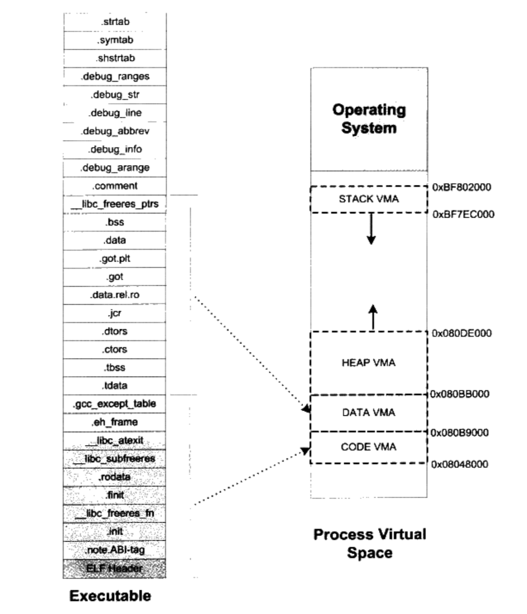

# 6. 可执行文件的装载与进程 

## 6.1 进程的虚拟地址空间

每个程序运行起来之后，都会拥有独立的虚拟地址空间(Virtual Address Space)，由cpu的位数决定。

32位平台有4GB的虚拟地址空间，我们不能任意使用。进程只能使用操作系统分配个进程的地址，如果访问未经允许的空间，操作系统会捕获这种访问，当作非法操作，强制结束进程。Linux 下的 "Segmentation fault"

linux 进程虚拟空间分布：


空间被分为两部分，0xC0000000~0xFFFFFFFF被操作系统用去，1GB。剩下的留给进程使用。
现代程序3GB的空间不够使用，在“PAE”一节中介绍。

就是剩下的3GB也不能全部给进程使用，还有其他用途。

### PAE

32位CPU，使用内存空间能否超过4GB？如果“空间”指的是虚拟地址空间，那么不能。如果“空间”指的是内存空间，那么可以。

Intel自1995年 Pentium Pro CPU开始采用36位的物理地址，也就是可以访问高达64GB的物理内存。扩展为36位地址线之后，Intel修改了页映射方式，这个地址扩展叫PAE(Physical Address Extension)

对于扩展的空间，普通应用程序无法感知其存在，这是操作系统的事。如应用程序中0x10000000\~0x20000000这段256MB的虚拟地址空间来做窗口，程序可以在高于4GB的物理空间申请多个大小为256的物理空间，编号A，B，C等。当用到A时，将0x10000000\~0x20000000映射到A，用到B，C时，再映射过去。windows下，这叫做AWE(Adress Windowing Extensions)；Linux下采用mmap()系统调用来实现。


## 6.2 装载方式

局部性原理，常用的放在内存，不常用的放在磁盘。

覆盖装入(Overlay)和页映射(Paging)是两种很典型的动态装载方法。

### 6.2.1 覆盖装入

虚拟内存发明前的方法，PC环境已淘汰。嵌入式等内存受限的环境下，仍然有使用，如DSP。


### 6.2.2 页映射

将内存和磁盘上的数据和指令，按“页”(Page)为单位，分为若干个页，以后装载和操作的单位就是页。硬件规定页大小一般为：4096字节，8192字节，2MB，4MB等，常见的Intel IA32一般使用4096字节的页。

假设32位机器，有16KB的内存，每个页面有4096字节，共4个页。

| 页编号    |  地址                   |
| :------- | :--------------------- |
| F0       | 0x00000000~0x00000FFF  |
| F1       | 0x00001000~0x00001FFF  |
| F2       | 0x00002000~0x00002FFF  |
| F3       | 0x00003000~0x00003FFF  |


假设程序有32KB数据和指令，被分为8个页。将它们编号为P0~p7。


## 6.3 从操作系统的角度看可执行文件的装载

### 6.3.1 进程的建立
 
一个进程它拥有独立的虚拟地址空间，使得它区别于其他进程。

创建一个进程，然后装载相应的可执行文件并执行，上述过程最开始只要做3件事。

* 创建一个独立的虚拟地址空间。
* 读取可执行文件头，并且建立虚拟地址空间与可执行文件的映射关系。
* 将CPU的指令寄存器设置成可执行文件的入口地址，启动运行。


#### 创建虚拟地址空间 

虚拟空间由一组页映射函数将虚拟空间的各个页映射至相应的物理空间，那么创建一个虚拟空间实际上并不是创建空间，而是创建映射函数所需要的相应的数据结构，在i386 Linux下，创建虚拟地址空间实际上只是分配一个页目录(Page Directory)就可以了，甚至不设置页映射关系，这些映射关系得到后面程序发生页错误的时候再进行设置。


#### 读取可执行文件头，并且建立虚拟地址空间与可执行文件的映射关系 

上一步是虚拟空间到物理内存的映射关系。这一步是虚拟空间到可执行文件的映射。

    可执行文件在装载时实际上是被映射的虚拟空间，所以可执行文件很多时候被叫做映像文件。


#### 将cpu指令寄存器设置成可执行文件入口，启动运行


### 6.3.2 页错误

上面的步骤执行完以后，其实可执行文件的真正指令和数据都没有被装入到内存中。操作系统只是通过可
执行文件头部的信息建立起可执行文件和进程虚存之间的映射关系而已。假设在上面的例子中，程序的入
口地址为0x08048000，即刚好是.text段的起始地址。当CPU开始打算执行这个地址的指令时，发现页
面0x08048000〜0x08049000是个空页面，于是它就认为这是一个页错误（Page Fault)。CPU将控制
权交给操作系统，操作系统有专门的页错误处理例程来处理这种情况。这时候我们前面提到的装载过程的
第二步建立的数据结构起到了很关键的作用，操作系统将查洵这个数据结构，然后找到空页面所在的VMA，
计算出相应的页面在可执行文件中的偏移，然后在物理内存中分配一个物理页面，将进程中该虚拟页与分
配的物理页之间建立映射关系，然后把控制权再还回给进程，进程从刚才页错误的位置重新幵始执行。

着进程的执行，页错误也会不断地产生，操作系统也会为进程分配相应的物理页面来满足进程执行的需求，
如图6-6所示。当然有可能进程所需要的内存会超过可用的内存数最, 特别是在有多个进程同时执行的时
候，这时候操作系统就需要精心组织和分配物理内存，甚至有时候应将分配给进程的物理内存地址收回等，
这就涉及了操作系统的虚拟存储管理。


## 6.4 进程虚存空间分布

### 6.4.1 ELF文件链接视图和执行视图

ELF文件，段的权限有几种组合

* 代码段为代表的权限位可读可执行段
* 以数据段和BBS段为代表的权限为可读可写的段
* 以只读数据段为代表的权限为只读段

为了减少空间浪费，将相同权限的段，合并在一起当作一个段进行映射。

比如.text和.init两个段


ELF引入了"Segment"，一个"Segment"包含了一个或多个属性类似的"Section"。正如上面所示，.text和.init段合并在一起看成一个整体映射，减少了页面内部碎片。节省了内存。

所以，从链接的角度，ELF文件是以"section"存储的；从装载的角度，ELF是以"segment"划分的。

```C
#include <stdlib.h>

int main()
{
    while(1){
        sleep(1000);
    }

    return 0;
}

```

    gcc -static SectionMapping.c -o SectionMapping.elf

使用readelf查看"section"


使用readefl读"segment"


只有LOAD类型的"Segment"需要被装载，其他起到辅助作用。


ELF可执行文件与进程虚拟空间映射关系


ELF可执行文件有个专门的数据结构叫做**程序头表**(Program Header Table)，用来保存"Segment"信息。
ELF可执行文件和共享库都有这个数据结构，而目标文件没有。

```c
typedef struct {
    Elf32_Word  p_type;
    Elf32_Off   p_offset;
    Elf32_Addr  p_vaddr;
    Elf32_Addr  p_paddr;
    Elf32_Word  p_filesz;
    Elf32_Word  p_memsz;
    Elf32_Word  p_flags;
    Elf32_Word  p_align;
} Elf32_Phdr;

```

| 成员      |  含义  |
| :------- | :------- | 
| p_type   | "Segment"类型，基本上我们在这里只关注"LOAD"类型的"Segment"。"LOAD"类型的常量为1。还有几个类型诸如"DYNAMIC"，"INTERP"等，动态链接时还会碰到。|
| p_offset | "Segment"在文件中的偏移。|
| p_vaddr  | "Segment"的第一个字节在进程虚拟地址空间的位置。整体程序头表中，所有"LOAD"类型的元素按照p_vaddr从小到大排列|
| p_paddr  | "Segment"的物理装载地址，这个物理地址就是LMA(Load Memory Address)，一般情况下，p_paddr和p_vaddr是一样的|
| p_filesz | "Segment"在ELF文件中占空间的长度。它的值可能是0，因为有可能这个"Segment"在ELF文件中不存在内容。|
| p_memsz  | "Segment"在进程虚拟地址空间中所占用的长度。它的值也可能为0 |
| p_flags  | "Segment"的权限属性，比如可读"R"，可写"W"，可执行"X" |
| p_align  | "Segment"的对齐属性。实际对齐字节等于2的p_align次。比如p_align等于10，那么实际的对齐字节数就是2的10次方，即1024字节。|


### 6.4.2 堆和栈

heap和stack分别占用一个VMA。

linux下通过/proc查看进程的虚拟空间分布:


* 第一列，VMA的地址范围
* 第二列，VMA的权限，r表示可读，w表示可写，x表示可执行，p表示私有(COW, Copy On Write)，s表示共享。
* 第三列偏移，表示VMA对应的Segment在映像中的偏移
* 第四列表示映像文件所在设备的主设备号和次设备号
* 第五列表示映像文件的节点号
* 最后一列是映像文件的路径

后面三个主设备号次设备号及文件节点都是0，表示它们没有映射到文件中。这种VMA叫做**匿名虚拟内存区**(Anonymous Virtual Memory Area)。vsdo的地址已经位于内核空间(即大于0xC0000000的地址)，事实上它是一个内核模型，进程可以通过访问这个VMA和内核进行通信。

一个进程可以划分为几种VMA区域：

* 代码VMA，权限只读，可以执行；有映像文件。
* 数据VMA，权限可读写，可执行；有映像文件。
* 堆VMA，权限可读写，可执行；无映像文件，匿名，可向上扩展。
* 栈VMA，权限可读写，不可执行；无映像文件，匿名，可向下扩展。





### 6.4.3堆的最大申请数量


### 6.4.4 段地址对齐

可执行文件要装载运行，需要通过虚拟内存的页映射机制完成。映射过程的最小单位是页。Intel 80x86系列处理器，默认页的大小为4096字节。


为了节省空间，有些UNIX系统采取取巧的做法


### 6.4.5 进程栈初始化

程序开始好运行的时候，需要传入一些环境变量和参数，常见的做法就是在进程启动前，将这些信息保存到进程的虚拟空间栈中（即VMA中的 Stack VMA）。

假设系统环中有2个环境变量:

    HOME=/home/user
    PATH=/usr/bin

我们运行该程序的命令为：

    prog 123

并假设栈底地址为0xBF802000

进程初始化的栈如下


## 6.5 Linux内核

