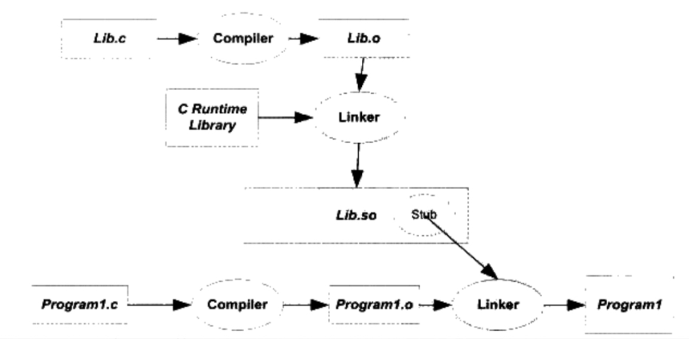
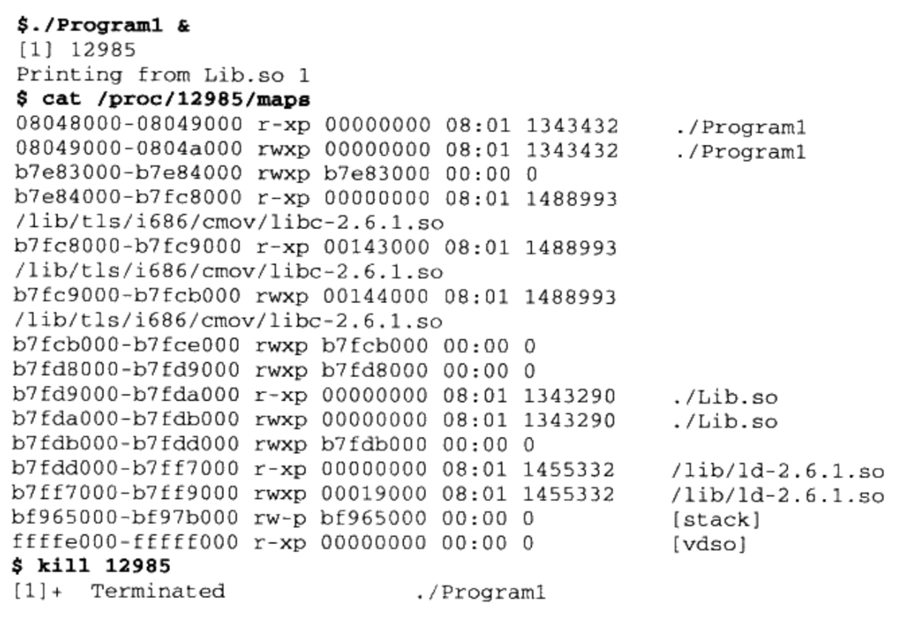
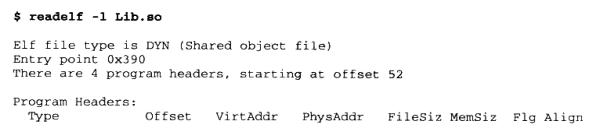
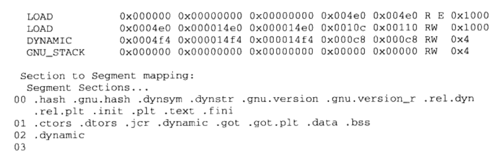
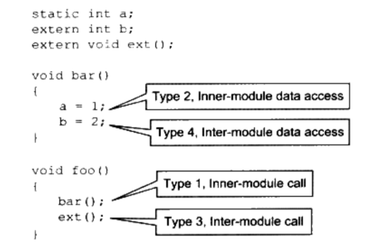
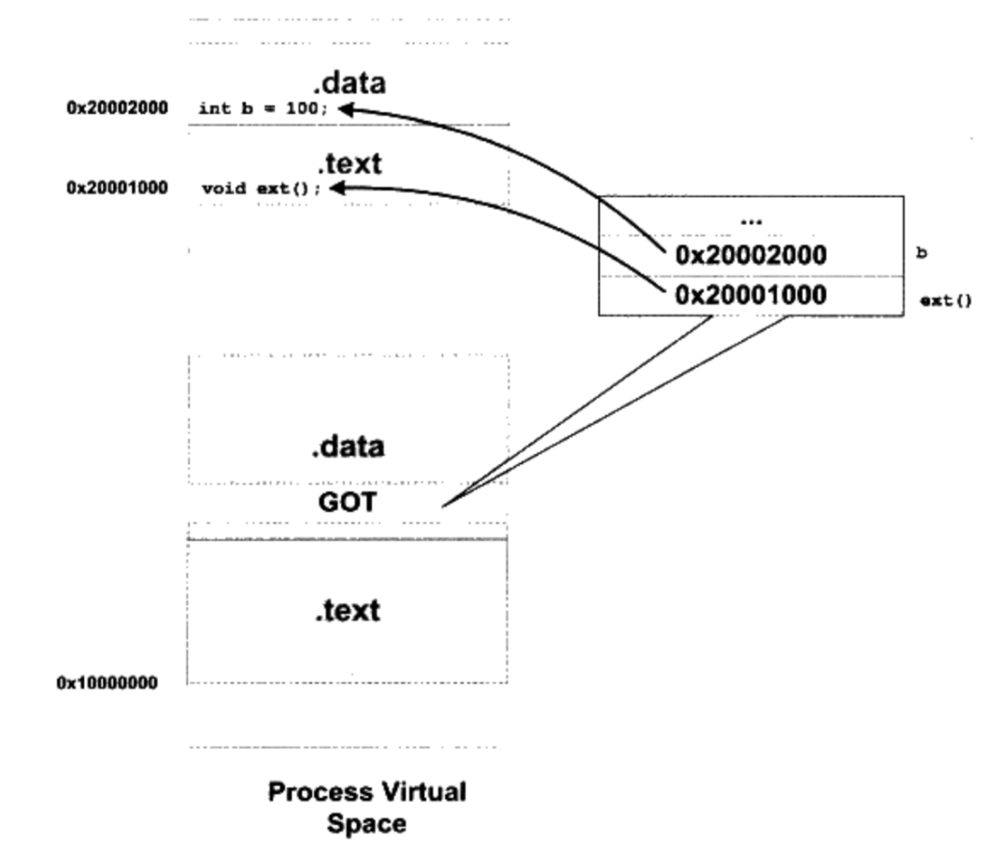
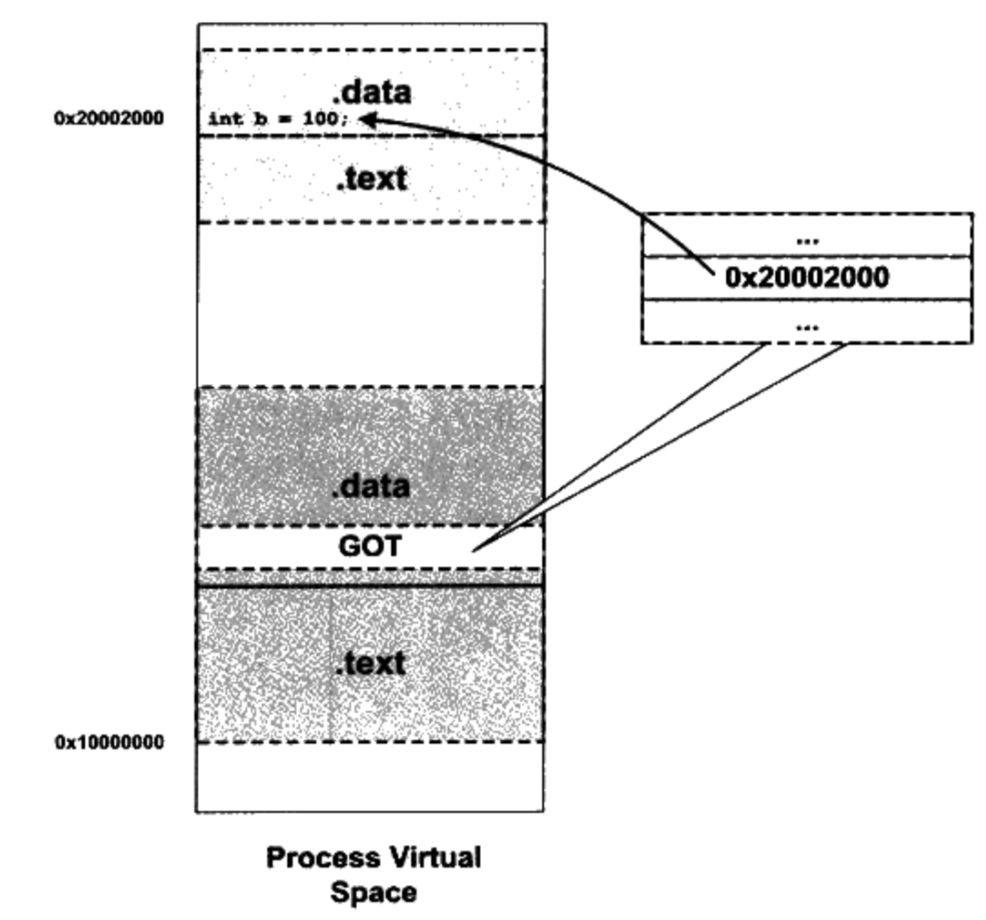

# 7. 动态链接 

## 7.1 为什么要动态链接

### 内存和磁盘空间

静态链接浪费内存和磁盘空间。

### 程序开发和发布

### 动态链接(Dynamic Linking)

### 程序可扩展性和兼容性

### 动态链接库基本实现

## 7.2 简单的动态链接例子

3个源文件 "Program1.c"，"Program2.c"，"lib.c"和"lib.h"

```c
/*Program1.c*/
#include "Lib.h"

int main()
{
    foobar(1);
    return 0;
}

/*Program2.c*/
#include "Lib.h"

int main()
{
    foobar(2);
    return 0;
}

/*Lib.c*/
#include <stdio.h>

void foobar(int i)
{
    printf("Printing from Lib.so %d\n", i);
}

/* Lib.h */
#ifndef LIB_H_
#define LIB_H_

void foobar(int i);

#endif

```

将Lib.c编译成共享库

    gcc -fPIC -shared -o Lib.so Lib.c

得到so后，再编译program1和program2

    gcc -o Program1 Program1.c ./Lib.so
    gcc -o Program2 Program2.c ./Lib.so



关于模块

    在静态链接的时，整个程序最终只有一个可执行文件，它是一个不可分割的整体。但是在动态链接下，一个程序被分成若干文件，有程序主要部分，即可执行文件(Program1)和程序所依赖的共享对象(Lib.so)，很多时候我们把这些部分称为模块，即动态链接下的可执行文件和共享文件都可以看作是程序的一个模块。

Program1.c被编译成Program.o的时候，编译器还不知道foobar的地址。当连接器将Program1.o链接成可执行文件时，需要确定foobar函数的性质。如果foobar是一个定在静态目标模块中的函数，那么连接器会按静态链接规则，将foobar重定位；如果foobar是定义在动态共享对象中的，连接器会将这个符号标记为动态链接符号，把地址重定位的过程留在装载时再进行。

连接器如何判断foobar是静态符号还是动态符号。Lib.so保留了完整的符号信息。


### 动态链接程序运行时地址空间分布

在lib.c中加入sleep函数

```C
#include <stdio.h>

void foobar(int i)
{
    printf("Printing form Lib.so %d\n", i);
    sleep(-1);
}

```

运行时查看进程虚拟地址空间分布



Lib.so和Program1都被映射至进程的虚拟地址空间，此外，还用到了动态链接形式的C语言运行库libc-2.6.1.so。此外，还有ld-2.6.so，linux下的动态连接器。动态连接器也被映射至进程虚拟地址空间，系统在运行Program1之前会把控制权交给动态连机器，由它完成链接工作后，再把控制权交给Program1，开始执行。


使用readefl查看Lib.so





## 7.3 地址无关代码

### 7.3.1 固定装载地址的困扰

不同模块加载，目标地址可能会冲突


### 7.3.2 装载时重定位

静态编译的时候叫做链接时重定位(Link Time Relocation)，现在叫做装载时重定位(Load Time Relocation)。在Windows中这种方法叫做基址重置(Rebashing)

### 7.3.3 地址无关代码

装载时重定位是解决动态模块中有绝对地址引用的办法之一，但是它无法让指令部分在多个进程之间共享。我们的目的是希望程序模块中共享的指令部分在装载时不需要因为装载地址的改变而改变，所以实现的基本思想就是把指令中那些需要修改的部分分离出来，跟数据部分放在一起，这样指令部分就可以保持不变，而数据部分可以在每个进程中拥有一个副本。这个方案就是目前被称为地址无关代码(PIC, Position-independent Code)技术。

按照对共享模块中的地址引用是否跨模块分为两类：模块内部引用和模块外部引用；
按照不同的引用方式又可分为：指令引用和数据引用。

- Type1 模块内部的函数调用，跳转等
- Type2 模块内部的数据防伪，比如模块内部定义的全局变量，静态变量。
- Type3 模块外部的函数调用，跳转等。
- Type4 模块外部的数据访问，比如其他模块中定义的全局变量。



在变上图代码时，编译器，无法确定变量b和函数ext是模块外部还是模块内部的。所以，编译器只能把它们都当作模块外部函数和变量来处理。MSVC编译器提供了__declspec(dllimport)编译器扩展来表示一个符号是模块内部的还是模块外部的。

#### 类型一 模块内部调用或跳转

调用与被调用者，处于同一模块，位置相对固定，对于现代操作系统来说，模块内部的跳转，函数调用都可以是相对地址调用，或者是基于寄存器的相对调用，所以这种指令是不需要重定位的。


#### 类型二 模块内数据访问
任何一个指令与它要访问的数据之间的相对位置是固定的，那么只需相对于当前指令加上固定的偏移量就能访问模块内部数据。


#### 类型三 模块间的调用或跳转
GOT中保存的时目标函数的地址。当模块需要调用目标函数时，可以通过GOT中的项进行简介跳转。



#### 类型四 模块间数据访问

模块间数据访问目标地址要等到装载时才能决定，比如上面的例子变量b，它被定义在其他模块，并且地址在装载时才能确定。

在数据段里建立一个指向目标函数的指针数组，也被称为全局偏移表(Global Offset Table, GOT)，当代码需要引用这些全局变量时，通过GOT中相应的项间接引用



当指令需要访问变量b时，程序会先找到GOT，然后根据GOT中变量所对应的项找到变量的目标地址。每个变量都对应一个4字节地址，链接器在装载模块的时候，会查找每个变量的地址，然后填充GOT的各个项。GOT本身放在数据段，所以它可以在模块装载时被修改，并且每个进程都可以有独立副本，互相不受影响。

#### 地址无关代码小结


|          | 指令跳转，调用           |  数据访问        |
| :------- | :--------------------- | :------------  |
| 模块内部  | (1) 相对跳转和调用       | (2) 相对地址访问  |
| 模块外部  | (3) 间接跳转和调用(GOT)  | (4) 间接访问(GOT) |


#### -fpic 和 -fPIC

pic和PIC功能上完全一样。
PIC 产生的代码要大
pic 产生代码相对较小，而且快。

由于地址无关代码与硬件平台相关，不同平台有不同的实现，pic在一些平台上会有限制，PIC则没有这个限制。`

#### 如何区分一个DSO是否为PIC

    readelf -d  foo.so | grep TEXTREL

如果有输出，则不是PIC的，否则就是PIC。PIC的DSO是不会包含任何代码重定位表的，TEXTREL表示代码重定位表地址。

#### PIC 与 PIE

地址无关代码技术也可以用在可执行文件上。地址无关可执行文件(PIE, Postion-Independent Executable)


### 7.3.4 共享模块的全局变量问题


### 7.3.5 数据段地址无关


## 7.4 延迟绑定(PLT)


